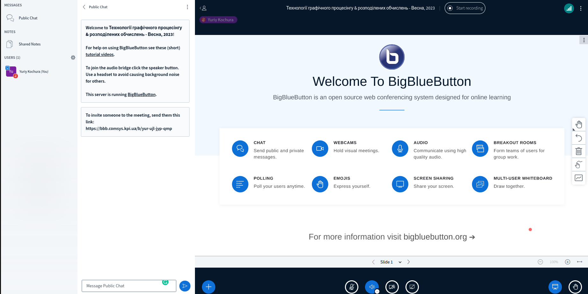
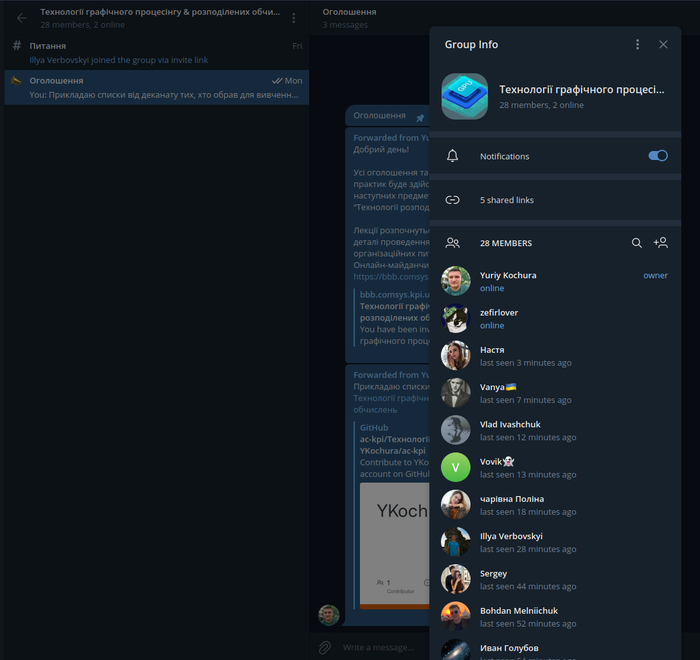
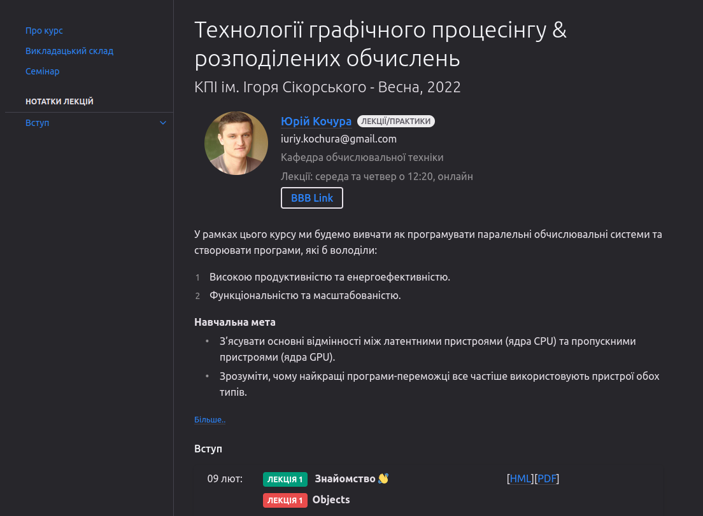
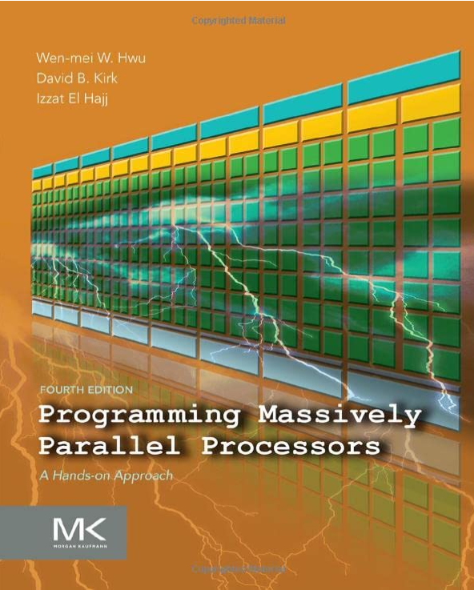
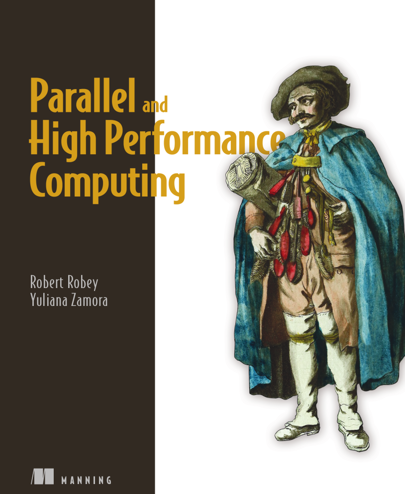

class: middle, center, title-slide 
 
# Технології графічного процесінгу & розподілених обчислень

Весна, 2022

  
Кочура Юрій Петрович 
[iuriy.kochura@gmail.com](mailto:iuriy.kochura@gmail.com)  
<a href="https://t.me/y_kochura">@y_kochura</a>  

---

# Інструктор

Лекції/Практики
- Кочура Юрій Петрович
  - Кафедра ОТ, ФІОТ

 

.center[
.circle.width-40[]
]

---

# Аудиторія

Цього семестру (Весна 2022) заняття проходять онлайн в .bold[*BigBlueButton*] за посиланням:  [https://bbb.comsys.kpi.ua/b/yur-ujl-jyp-qmp](https://bbb.comsys.kpi.ua/b/yur-ujl-jyp-qmp)

.center.width-100[]

---

class: middle

# Обговорення

.smaller-xx[Усі оголошення та обговорення щодо матеріалів лекцій та практик буде здійснюватись в Telegram (повідомте мене, якщо Вас потрібно додати в цю групу)

- Задавайте питання, які Вас турбують. 
- Не соромтесь!
]

.center.width-25[]

---

class: middle 

# Матеріали лекцій

Матеріали лекцій будуть розміщуватись за посиланням: [https://courses-cs-kpi.github.io/pd-22sp/](https://courses-cs-kpi.github.io/pd-22sp/)

- Формат матеріалів: HTML та PDF

.center.width-75[]

---

class: middle

# Опис

У рамках цього курсу ми будемо вивчати як програмувати паралельнi обчислювальнi системи та створювати програми, якi б володiли:

- Високою продуктивнiстю та енергоефективнiстю.
- Функцiональнiстю та масштабованiстю.

---

class: middle

# Навчальна мета

- З’ясувати основнi вiдмiнностi мiж латентними пристроями (*ядра CPU*) та пропускними пристроями (*ядра GPU*). 
- Зрозумiти, чому найкращi програми-переможцi все частiше використовують пристрої обох типiв.

---

class: middle

# Потрібні навички

- Базовi знання *C/C++* та *Python*: типи даних, цикли, умови, функцiї та манiпуляцiї з масивом. 
- Обiзнанiсть з *NumPy*, включаючи використання *ndarrays* та *ufuncs*.
- Знання англiйської: можливiсть зрозумiти основний змiст поставленого завдання.

---

class: middle

# Підручники

 Деякі корисні книги, які можуть стати Вам у нагоді під час опанування курсу:

.smaller-xx.grid[
.kol-1-2[
[.center.width-85[]](https://www.amazon.com/Programming-Massively-Parallel-Processors-Hands/dp/0128119861/ref=sr_1_fkmr0_2?crid=2YR2Y8FMYMZRB&keywords=Programming+Massively+Parallel+Processors%3A+A+Hands-on+Approach+3rd+Edition&qid=1643962972&s=books&sprefix=programming+massively+parallel+processors+a+hands-on+approach+3rd+edition+%2Cstripbooks-intl-ship%2C171&sr=1-2-fkmr0)
.center[Amazon - EN]
]

.kol-1-2[
[.center.width-80[]](https://livebook.manning.com/book/parallel-and-high-performance-computing/chapter-1/69)
.center[Безкоштовний перегляд - EN]
  ]
]

---

class: middle

# Особливості

- Для магiстрiв 1-го курсу
- Мова викладання: українська, англiйська
- 12 лекцій
- 4 практичнi роботи + контрольна + семінар
- Технології графічного процесінгу: **екзамен**
- Технології розподілених обчислень: **залік**

---

class: middle

# Система оцінювання

- 40% &nbsp;&emsp; Практичнi завдання (10% кожне)
- 10% &nbsp;&emsp; Контрольна
- 20% &nbsp;&emsp; Семінар
- 30% &nbsp;&emsp; Екзамен/залік

Важливо! Умова допуску до семестрового контролю (екзамену/заліку):

 
 Практичнi завдання + Контрольна + Семінар ≥ 42%

---

class: middle

# Кодекс честі

.smaller-x[Ви можете обговорювати завдання практичних робiт у групах. Однак, кожен студент/студентка повинен/повинна пiдготувати розв’язки завдань самостiйно.

Пiд час проходження цього курсу Ви зобов’язанi дотримуватись [Кодекс честi](https://kpi.ua/code) КПI iм. Iгоря Сiкорського та усi наступнi правила:

  1. Кожен з Вас повинен вiдправляти на перевiрку власно виконану роботу. Використання чужих розв’язкiв або програмного коду i представлення їх за свої напрацювання є плагiатом та серйозним порушенням основних академiчних стандартiв.
  1. Ви не повиннi дiлитися своїми розв’язками з iншими студентами, а також просити iнших дiлитися своїми розв’язками з Вами.

  1. Якщо Ви отримували допомогу у вирiшеннi певного завдання, Ви повиннi зазначити це у звiтi, а саме: вiд кого та яку допомогу отримали.]

---

class: end-slide, center
count: false

.larger-xx[Почнемо 🎬⏳] 