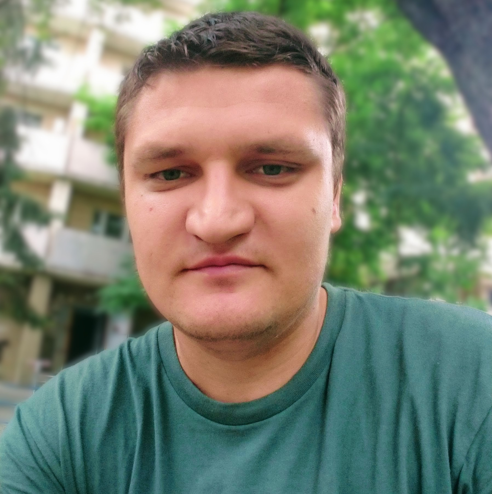
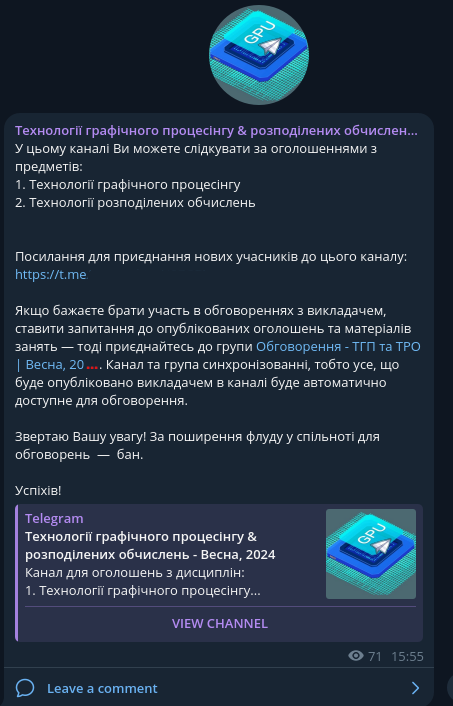

class: middle, center, title-slide 
 
# Технології графічного процесінгу & розподілених обчислень

Весна, 2024

  
Кочура Юрій Петрович 
[iuriy.kochura@gmail.com](mailto:iuriy.kochura@gmail.com)  
<a href="https://t.me/y_kochura">@y_kochura</a>  

---

# Інструктор

Лекції/Практики
- Кочура Юрій Петрович
  - Кафедра ОТ, ФІОТ

 

.center[
.circle.width-40[]
]

---

# Аудиторія

- Цього семестру .highlight[.bold[лекції]] та .highlight[.bold[практики]] в асинхронному режимі онлайн  
 
- Семінар в синхронному режимі онлайн на платформі .bold[*BigBlueButton*]:
.alert[BBB кімната:  [https://bbb.comsys.kpi.ua/rooms/yur-ujl-jyp-qmp/join](https://bbb.comsys.kpi.ua/rooms/yur-ujl-jyp-qmp/join)]

.center.width-100[]

---

class: middle

# Оголошення та обговорення

.smaller-x[Усі *оголошення* та *обговорення* будуть здійснюватись в Telegram (повідомте мене, якщо потрібно Вас додати)

- Задавайте питання, які Вас турбують
- Не соромтесь!
]

.grid[
.kol-1-2[
.center.width-70[]
.center.smaller-x[Оголошення]
]

.kol-1-2[
.center.width-70[]
.center.smaller-x[Обговорення]
]
]

---

class: middle

# Що робити, якщо розпочалась повітряна тривога?

У випадку оголошення повітряної тривоги у Вашому місті &mdash; залиште заняття та прямуйте до найближчого укриття. 

---

class: middle 

# Вебсторінка

Усі навчальні матеріали та завдання будуть розміщуватись на цій вебсторінці:  [https://courses-cs-kpi.github.io/pd-24sp/](https://courses-cs-kpi.github.io/pd-24sp/)

.center.width-75[]

---

class: middle

# Опис

У рамках цього курсу ми будемо вивчати як програмувати паралельнi обчислювальнi системи та створювати програми, якi б володiли:

- Високою продуктивнiстю та енергоефективнiстю.
- Функцiональнiстю та масштабованiстю.

---

class: middle

# Навчальна мета

- З’ясувати основнi вiдмiнностi мiж латентними пристроями (*ядра CPU*) та пропускними пристроями (*ядра GPU*). 
- Зрозумiти, чому найкращi програми-переможцi все частiше використовують пристрої обох типiв.

---

class: middle

# Потрібні навички

- Базовi знання *C/C++* та *Python*: типи даних, цикли, умови, функцiї та манiпуляцiї з масивом. 
- Обiзнанiсть з *NumPy*, включаючи використання *ndarrays* та *ufuncs*.
- Знання англiйської: можливiсть зрозумiти основний змiст поставленого завдання.

---

class: middle

# Підручники

 Деякі корисні книги, які можуть стати Вам у нагоді під час опанування курсу:

.smaller-xx.grid[
.kol-1-2[
[.center.width-85[]](https://www.amazon.com/Programming-Massively-Parallel-Processors-Hands/dp/0128119861/ref=sr_1_fkmr0_2?crid=2YR2Y8FMYMZRB&keywords=Programming+Massively+Parallel+Processors%3A+A+Hands-on+Approach+3rd+Edition&qid=1643962972&s=books&sprefix=programming+massively+parallel+processors+a+hands-on+approach+3rd+edition+%2Cstripbooks-intl-ship%2C171&sr=1-2-fkmr0)
.center[Amazon - EN]
]

.kol-1-2[
[.center.width-80[]](https://livebook.manning.com/book/parallel-and-high-performance-computing/chapter-1/69)
.center[Безкоштовний перегляд - EN]
  ]
]

---

class: middle

# Особливості

- Для магiстрiв 1-го курсу
- Мова викладання: українська, англiйська
- 8 лекцій
- 4 семінари
- 4 практичнi роботи + контрольна 
- Технології графічного процесінгу: **екзамен**
- Технології розподілених обчислень: **залік**

???
 Звичайно, що просто прослухавши лекції та виконавши усі практичні роботи, ви не станете першокласним спеціалістом. Значною мірою усе залежить тільки від ваших особистих зусиль.
  
---

class: middle

# Практичні завдання

Вправи, які допоможуть Вам краще познайомитись з предметом. 

---

class: middle

# Семінар 

Семінарське заняття &mdash; форма навчального заняття, при якій викладач організує дискусію навколо попередньо визначених тем, до котрих студенти готують тези виступів на підставі індивідуально виконаних завдань (рефератів). Семінарські заняття проводяться в аудиторіях, навчальних кабінетах або на онлайн-зустрічах з однією академічною групою. 

.footnote[Джерело: [Вікіпедія](https://uk.wikipedia.org/wiki/%D0%A1%D0%B5%D0%BC%D1%96%D0%BD%D0%B0%D1%80)]

???
Семінари (метод викладання) &mdash; англ. Seminars (teaching method) &mdash; зібрання групи студентів, які зайняті науковими дослідженнями або вивченням наукових проблем, під керівництвом одного або декількох викладачів для обговорення питань, що представляють взаємну цікавість.

Семінарське заняття &mdash; форма навчального заняття, при якій викладач організує дискусію навколо попередньо визначених тем, до котрих студенти готують тези виступів на підставі індивідуально виконаних завдань (рефератів). Семінарські заняття проводяться в аудиторіях, навчальних кабінетах або на онлайн-зустрічах з однією академічною групою.

---

class: middle

# Система оцінювання

- 40% &nbsp;&emsp; Практичнi завдання (10% кожне)
- 10% &nbsp;&emsp; Контрольна
- 20% &nbsp;&emsp; Семінар
- 30% &nbsp;&emsp; Екзамен/залік

Важливо! Умова допуску до семестрового контролю (екзамену/заліку):

 
 Практичнi завдання + Контрольна + Семінар ≥ 42%

---

class: middle 
# Шкала оцінок

Шкала оцiнок [КПI iм. Iгоря Сiкорського](https://kpi.ua/grading):

.center.width-65[]

---

class: middle 
# Кодекс честі

## Академічна доброчесність

Ви можете обговорювати завдання практичних робiт у групах. Однак, кожен студент(-ка)
повинен(-на) пiдготувати розв’язки завдань самостiйно. Пiд час проходження цього курсу Ви
зобов’язанi дотримуватись політики та принципів академічної доброчесності визначених
Кодексом честi КПI iм. Iгоря Сiкорського ([Розліл 3](https://kpi.ua/code)) та усi наступнi
правила:

1. Кожен з Вас повинен вiдправляти на перевiрку власно виконану роботу. Використання чужих розв’язкiв або програмного коду i представлення їх за свої напрацювання є плагiатом та серйозним порушенням основних академiчних стандартiв.

1. Ви не повиннi дiлитися своїми розв’язками з iншими студентами, а також просити iнших дiлитися своїми розв’язками з Вами.

1. Якщо Ви отримували допомогу у вирiшеннi певного завдання, Ви маєте зазначити це у звiтi, а саме: вiд кого та яку допомогу отримали.

---

class: middle 
# Кодекс честі

## Норми етичної поведінки

Норми етичної поведінки студентів і працівників університету визначені у [розділі 2 Кодексу честі](https://kpi.ua/code) 
Національного технічного університету України «Київський політехнічний інститут імені Ігоря
Сікорського».

---

class: middle 
# Кодекс честі

## Виконання завдань: практики та семінар

Викладачем встановлюється граничний термін для виконання усіх видів завдань з метою послідовного і збалансованого засвоєння студентами навчального матеріалу та моніторингу виконання здобувачами індивідуальних навчальних планів згідно з графіком навчального процесу. Здача на перевірку виконаних завдань після встановлених термінів
супроводжується штрафними балами. Кінцевим терміном для здачі на перевірку усіх видів завдань є останнє заняття з комп’ютерного практикуму. У період проведення в університеті заліково-екзаменаційної сесії приймання завдань не буде здійснюватись. На перездачі кожен має можливість переробити або доопрацювати завдання з метою підвищення свого поточного рейтингу.

---

class: middle 
# Кодекс честі

## Процедура оскарження оцінок

Якщо студент(-ка) вважає, що його(її) роботу недооцінено або переоцінено — потрібно
звернутися до викладача, який здійснював оцінювання та повідомити про це із зазначенням
короткого обґрунтування (оцінка буде переглянута).

---

class: middle 
# Як успішно завершити курс?

???
Викладач зацікавлений у тому, щоб усі досягли успіху під час вивчення дисципліни та дізналися якомога більше не лише про “зміст предмету”, а й про те, як ми можемо покращити світ навколо нас. 

---

class: middle 
count: false
# Як успішно завершити курс?

  - Визначте пріоритети
    - Використовуйте свій час та енергію так, щоб могли досягти поставлених цілей у навчанні, роботі та власному житті.

---

class: middle 
count: false
# Як успішно завершити курс?

  - Визначте пріоритети
    - Використовуйте свій час та енергію так, щоб могли досягти поставлених цілей у навчанні, роботі та власному житті.

  - Працюйте систематично
    - Подібно до спортивних тренувань, навчання вимагає систематичності та регулярності для того, щоб досягти реального прогресу.

---

class: middle 
count: false
# Як успішно завершити курс?

  - Визначте пріоритети
    - Використовуйте свій час та енергію так, щоб могли досягти поставлених цілей у навчанні, роботі та власному житті.

  - Працюйте систематично
    - Подібно до спортивних тренувань, навчання вимагає систематичності та регулярності для того, щоб досягти реального прогресу.

  - Спілкуйтеся з однодумцями
    - Знайдіть друга з яким зможете обговорювати матеріали лекцій і не тільки. Слідкуйте за людьми, трудовою етикою яких Ви захоплюєтесь &mdash; успішні люди надихаю.

---

class: middle 
count: false
# Як успішно завершити курс?

  - Визначте пріоритети
    - Використовуйте свій час та енергію так, щоб могли досягти поставлених цілей у навчанні, роботі та власному житті.

  - Працюйте систематично
    - Подібно до спортивних тренувань, навчання вимагає систематичності та регулярності для того, щоб досягти реального прогресу.

  - Спілкуйтеся з однодумцями
    - Знайдіть друга з яким зможете обговорювати матеріали лекцій і не тільки. Слідкуйте за людьми, трудовою етикою яких Ви захоплюєтесь &mdash; успішні люди надихаю.

  - Залишайтесь духовно та фізично здоровими
    - Навчаючись онлайн, швидше за все, Ви будете проводите більше часу за комп’ютером, ніж це було б під час офлайн навчання, тому не забувайте робити перерви, ходити на прогулянки, спати рекомендовану кількість годин та їсти здорову їжу для підтримання свого організму.

---

class: end-slide, center
count: false

.larger-xx[Почнемо 🎬⏳] 