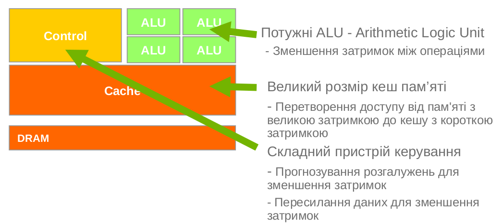
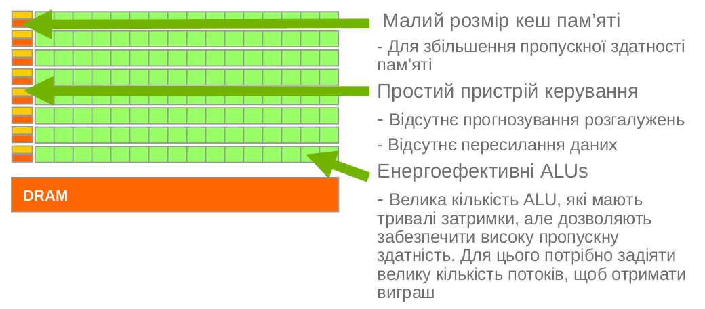
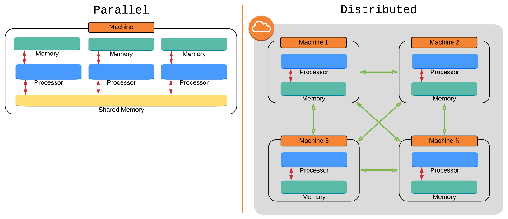
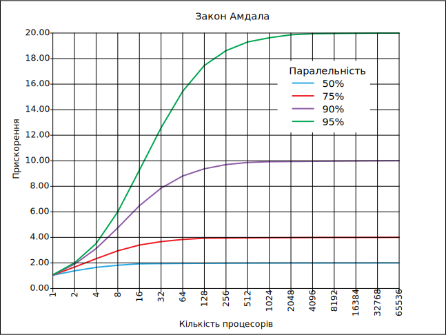
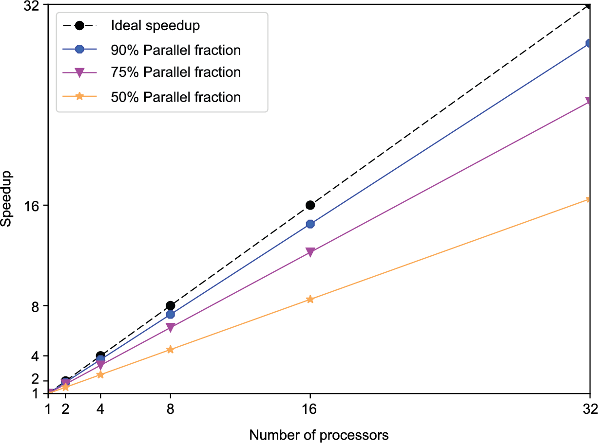

class: middle, center, title-slide 
 
# Технології графічного процесінгу & розподілених обчислень

Лекція 1: Вступ

  
Кочура Юрій Петрович 
[iuriy.kochura@gmail.com](mailto:iuriy.kochura@gmail.com)  
<a href="https://t.me/y_kochura">@y_kochura</a>  

???
У рамках цього курсу Ви отримаєте практичний досвід створення програм для процесорів із масивними паралельними обчислювальними ресурсами. Загалом ми будемо називати процесор масивно паралельним, якщо він має здатність виконувати більше 64 арифметичних операцій за такт.  Багато комерційних пропозицій від NVIDIA, AMD та Intel пропонують такі рівні паралельності. Ефективне програмування цих процесорів вимагає глибоких знань про принципи паралельного програмування, а також моделі паралельності, моделі зв’язку, архітектуру обладнання та обмеження ресурсів цих процесорів.

---

class: middle

# Сьогодні

- Будова CPU та GPU
- Переваги використання GPUs
- Паралельний vs Розподілений
- Основні закони паралельних обчислень
- Області застосування гетерогенних паралельних обчислень

---

class: middle

# Сьогоднішні виклики обчислень

- Навички *виконання обчислень* є важливими для вивчення практично усіх дисциплін
- *Наука про дані* та *машинне навчання* стають основними навичками в більшості STEM
- Практично всі *процесори багатоядерні*, від мікроконтролерів до суперкомп'ютери
- Промисловість і наукові відкриття вимагають *ШІ* та *прискорених обчислень*

???
STEM (Science, Technology, Engineering and Mathematics, укр. наука, технології, інженерія, математика) &sdash; термін, яким називають підхід до освітнього процесу; відповідно до якого основою набуття знань є проста та доступна візуалізація наукових явищ, що дає змогу легко охопити і здобути знання на основі практики та глибокого розуміння процесів. 

Акронім STEM був запропонований в 2001 році для позначення тренду в освітній та професійній сферах науковцями Національного наукового фонду США. 

---

class: middle

# Переваги використання GPUs

.center[
.width-100[]
]

.center.grid[
.smaller-x.kol-1-2[
Central Processing Unit (CPU)
]
.smaller-x.kol-1-2[
Graphics Processing Unit (GPU)
]
]

.footnote[Джерело слайду: [CUDA C++ Programming Guide](https://docs.nvidia.com/cuda/cuda-c-programming-guide/index.html#fnsrc_1), NVIDIA]

???
Графічний процесор (GPU) забезпечує набагато вищу пропускну здатність команд і пропускну здатність пам’яті, ніж CPU, при аналогічній ціні та потужності. Багато програм використовують ці можливості, щоб працювати швидше на GPU, ніж на CPU. Інші обчислювальні пристрої, такі як Field-Programmable Gate Array (FPGA) - програмовані користувачем вентильні матриці, також дуже енергоефективні, але пропонують набагато меншу гнучкість програмування, ніж графічні процесори. 

Термін **графічний** походить від того факту, що два десятиліття тому (у 1999 році термін GPU був популяризований Nvidia, яка створила перший графічний процесор GeForce 256), коли GPU був вперше створений, він був розроблений як спеціалізований процесор для прискорення візуалізації графіки. 

Сучасні графічні процесори дуже ефективно управляють комп’ютерною графікою та обробкою зображень, крім того GPU використовують і для обчислень (Обчислення загального призначення на графічних процесорах (GPGPU).  Висока пропускна здатність GPU робить їх більш ефективними, ніж центральні процесори загального призначення (ЦП) для алгоритмів, які обробляють великі блоки даних паралельно. У персональному комп'ютері графічний процесор може бути присутнім у вигляді окремого пристрою (відеоадаптер) або вбудований в материнську плату. У деяких CPU вони вбудовані в кристали ЦП.

Ця різниця у можливостях між GPU та CPU існує тому, що вони мають різну архітектуру, оскільки розроблені для різних цілей. У той час як центральний процесор розроблений таким чином, щоб якнайшвидше виконувати послідовність операцій (архітектура орієнтована на зменшення затримок), або ще називають потоки (threads), прицьому CPU може виконувати кілька десятків цих потоків паралельно;  графічний процесор розроблений так, щоб виконувати тисячі потоків паралельно (архітектура орієнтова на збільшення пропускної здатності).

Графічний процесор спеціалізується на високо паралельних обчисленнях і, отже, розроблений таким чином, що більшість транзисторів здійснюють обробку даних, а не кешування даних та контроль потоків. Схематичний малюнок на цьому слайді показує приклад розподілу ресурсів мікросхеми для CPU та GPU.
графічний процесор. 

---

class: middle

## CPU та GPU спроектовані дуже по-різному

.center[
.width-100[]
]

.center.grid[
.smaller-xx.kol-1-2[
Ядра орієнтовані на зменшення затримок 
Latency Oriented Cores
]
.smaller-xx.kol-1-2[
Ядра орієнтовані на збільшення пропускної здатності
Throughput Oriented Cores
]
]

.footnote[Джерело слайду: [CUDA C++ Programming Guide](https://docs.nvidia.com/cuda/cuda-c-programming-guide/index.html#fnsrc_1), NVIDIA]

???
Виділення більше транзисторів на обробку даних, наприклад, на обчислення з плаваючою комою, вигідно для високо паралельних обчислень; графічний процесор може приховати затримки доступу до пам’яті за допомогою обчислень, замість того, щоб покладатися на великі кеш-пам’яті та складний елемент контроль потоку для уникнення довгих затримок доступу до пам’яті, обидва з яких є дорогими з точки зору транзисторів.

Загалом, якщо це можливо, програму можна поділити на дві частини: паралельну і послідовну частини. Тому системи розроблені з поєднанням графічних і центральних процесорів дозволяють максимізувати загальну продуктивність. Програми з високим ступенем розпаралелення можуть використовувати графічні процесори для досягнення вищої продуктивності, ніж на CPU. 

---

class: middle

## CPU: Архітектура орієнтована на зменшення затримок 

.center[
.width-100[]
]

---

class: middle

## GPU: Архітектура орієнтована на збільшення пропускної здатності 

.center[
.width-100[]
]

---

class: middle

# CPU vs GPU  

.center.grid[
.smaller-x.kol-1-2[
.width-80[]

.center.smaller-xx[Джерело: [12th Gen Intel Core](https://www.intel.com/content/www/us/en/products/docs/processors/core/12th-gen-core-mobile-processors-brief.html)]

- 12th Gen Intel Core
    - 14 Processor Cores
    - 10 nm process
]
.smaller-x.kol-1-2[
 
.width-100[]
.center.smaller-xx[Джерело: [NVIDIA Ampere Architecture In-Depth](https://developer.nvidia.com/blog/nvidia-ampere-architecture-in-depth/)]

 
- NVIDIA A100
    - 6912 CUDA Cores
    - 7 nm process
]
]

---

class: middle

## Програми-переможці використовують як CPU так і GPU  

.center.grid[
.kol-1-2[CPU використовують для послідовних частин коду, де затримки мають значення

.smaller-xx.alert[CPU може бути в $\times10$+ швидшим ніж GPU для частин програми, які виконуються послідовно]
]

.kol-1-2[GPU використовують для паралельних частин коду, де пропускна здатність виграє

.smaller-xx.alert[GPU може бути в $\times10$+ швидшим ніж CPU для частин програми, які можуть бути виконані паралельно]
]]

---

class: middle

# Паралельний vs Розподілений 

.center[
.width-100[]
]

.smaller-x.success[Паралельні обчислення &mdash; обчислення, які виконуються одночасно на кількох процесорах в одній системі &mdash; багатопотоковій.

Розподілені обчислення &mdash; використання кількох процесорів на кількох машинах, які спілкуються через мережу.]

.footnote[Джерело слайду: [Advanced Algorithms and Data Structures (2021)](https://livebook.manning.com/book/algorithms-and-data-structures-in-action/chapter-13/23), Marcello La Rocca]

???
Паралельні обчислення обмежені кількістю ядер на одній машині, тоді як розподілені обчислення є кращим підходом для масштабування систем та обробки величезних наборів даних. З іншого боку, якщо набір даних може поміститися в пам’ять однієї машини, результати паралельного обчислення будуть значно швидшими, оскільки процеси можуть спілкуватися через спільну пам’ять, тоді як вузли в розподілених системах повинні обмінюватися інформацією через мережу (під час запису, затримка становить $100$ нс проти $150$ мс під час обміну через мережу, отже, коефіцієнт $10^6$). 

---

class: blue-slide, middle, center
count: false

.larger-xx[Чому паралельні обчислення важливі?]

---

class: middle

.center[
.width-100[]
]

.footnote[Джерело слайду: [42 Years of Microprocessor Trend Data](https://www.karlrupp.net/2018/02/42-years-of-microprocessor-trend-data/), Karl Rupp]

???
Майбутнє паралельне. Збільшення продуктивності послідовного зв’язку вийшло на плато. На цьому слайді показані тенденції по роках тактової частоти (швидкість, з якою може виконуватися інструкція), споживання енергії, кількості обчислювальних ядер та продуктивність апаратного забезпечення для звичайних процесорів. 

У 2005 році кількість ядер різко зросла з одного ядра до кількох ядер. У той же час тактова частота та споживана потужність вийшли на насичення. Теоретична продуктивність постійно зростала, оскільки продуктивність пропорційна добутку тактової частоти та кількості ядер. Цей зсув у бік збільшення кількості ядер, а не тактової частоти, вказує на те, що досягнення кращої продуктивності центрального процесора (CPU) можливе лише за допомогою паралельних обчислень.

---

class: middle

.center[
.width-100[]
]

.footnote[Джерело слайду: [Parallel and High Performance Computing](https://livebook.manning.com/book/parallel-and-high-performance-computing/chapter-1), Robert Robey and Yuliana Zamora]

---

class: blue-slide, middle, center
count: false

.larger-xx[Які потенційні переваги паралельних обчислень?]

---

class: middle

- Прискорення часу виконання програм
- Підвищення енергоефективності
- Вирішення великих проблем

.footnote[Джерело слайду: [Parallel and High Performance Computing](https://livebook.manning.com/book/parallel-and-high-performance-computing/chapter-1), Robert Robey and Yuliana Zamora]

???
Паралельні обчислення можуть скоротити час воконання програм, підвищити енергоефективність у вашій програмі та дозволити вам вирішувати більші проблеми на існуючому обладнанні. Сьогодні паралельні обчислення більше не є єдиним доменом найбільших обчислювальних систем. Зараз ця технологія присутня на настільних комп’ютерах або ноутбуках і навіть на портативних пристроях. Це дає можливість кожному розробнику створювати паралельне програмне забезпечення на своїх локальних системах, тим самим значно розширюючи можливості для нових програм.

Передові дослідження як у промисловості, так і в академічних колах відкривають нові області для паралельних обчислень, оскільки інтерес з наукових обчислень поширюється на машинне навчання, великі дані, комп’ютерну графіку та користувацькі програми. Поява нових технологій, таких як самокеровані автомобілі, комп’ютерний зір, розпізнавання голосу та AI, вимагає великих обчислювальних можливостей, де необхідно обробляти масивні навчальні набори даних.

В наукових обчисленнях, які довгий час були виключною сферою паралельних обчислень, також з’являються нові, захоплюючі можливості. Поширення дистанційних датчиків і портативних пристроїв, які можуть передавати дані в датацентри для їх подальшої обробки та прийняття рішень щодо природних і техногенних катастроф.

---

class: blue-slide, middle, center
count: false

.larger-xx[Основні закони паралельних обчислень]

???
У послідовних обчисленнях всі операції прискорюються за рахунок збільшенням тактової частоти. На відміну послідовних обчислень, для розпаралелювання програми нам потрібно трохи докласти зусиль та змінити наші програми, щоб ефективно можна було використовувати обладнання (GPU). Для визначення ступеня розпаралелювання програми вводять таку величину як рівень розпаралелювання. Чому рівень розпаралелювання важливий? Щоб зрозуміти це, давайте подивимося на закони паралельних обчислень. 

---

class: middle

## Межа для паралельних обчислень: закон Амдала 

.center[
.width-70[]]

$$\text{SpeedUp}(N) = \frac{1}{S + \frac{P}{N}},$$
де $N$ &mdash; кількість процесорів, $S$ &mdash; частина яку можна виконувати послідовно,  $P$ &mdash; частина яку можна виконувати паралельно, $S + P = 1$

.footnote[Джерело слайду: [Закон Амдала](https://uk.wikipedia.org/wiki/%D0%97%D0%B0%D0%BA%D0%BE%D0%BD_%D0%90%D0%BC%D0%B4%D0%B0%D0%BB%D0%B0), Вікіпедія]

???
Нам потрібен спосіб для знаходження потенційного прискорення виконання програми на основі рівня розпаралелювання. Це можна зробити за допомогою закону Амдала, запропонованого Джином Амдалом у 1967 році. 

Закон стверджує, що невелика частина програми, що не піддається розпаралелюванню, обмежить загальне прискорення від розпаралелювання. Будь-яка велика математична чи інженерна задача зазвичай буде складатись з кількох частин, що можуть виконуватись паралельно, та кількох частин що виконуються тільки послідовно. Цей зв'язок задається рівнянням.

Якщо послідовна частина програми виконується 10 % всього часу роботи, неможливо прискорити виконання такої програми більше ніж в 10 разів — незалежно від того, скільки процесорів використовує програма.  

Таким чином закон визначає верхню межу корисності від збільшення кількості процесорів в обчислювальній системі.

---

class: middle

## Прорив паралельної межі: закон Густафсона-Барсіса 

.center[
.width-70[]]

$$\text{SpeedUp}(N) = N - S \cdot (N - 1),$$
де $N$ &mdash; кількість процесорів, $S$ &mdash; частина яку можна виконувати послідовно

.footnote[Джерело слайду: [Parallel and High Performance Computing](https://livebook.manning.com/book/parallel-and-high-performance-computing/chapter-1), Robert Robey and Yuliana Zamora]

???

У 1988 році Густафсон і Барсіс зазначили, що паралельне виконання коду повинно збільшити розмір проблеми, оскільки залучається більше процесорів. Це може дати нам альтернативний спосіб обчислити потенційне прискорення нашої програми. Якщо розмір проблеми зростає пропорційно кількості процесорів, то прискорення виражається наступним чином.

Закон Густафсона вирішує недоліки закону Амдала, який базується на припущенні фіксованого розміру проблеми, тобто робочого навантаження на виконання, яка не змінюється щодо покращення ресурсів. Натомість закон Густафсона передбачає, що програмісти мають тенденцію збільшувати розмір проблем, щоб повністю використовувати обчислювальну потужність, яка стає доступною в міру покращення ресурсів. 

---

class: blue-slide, middle, center
count: false

.larger-xx[Застосування]

---

class: middle

## Застосування гетерогенних паралельних обчислень

.center[
.width-100[]]

.footnote[Джерело слайду: [GPU Applications Catalog](https://www.nvidia.com/en-us/gpu-accelerated-applications/), NVIDIA]

---

class: middle, center, black-slide

<iframe width="600" height="450" src="https://www.youtube.com/embed/-P28LKWTzrI" frameborder="0" allowfullscreen></iframe>

Mythbusters Demo GPU versus CPU

???
Mythbusters (Руйнівники міфів) (англ. myth &mdash; міф, вигадка) + (англ. bust  &mdash; зруйновувать, знищувать) 

Руйнівники міфів &mdash; програма телеканалу Discovery. Тема програми - перевіряти різні міфи (легенди). Деякі міфи беруться з Голівудських фільмів.

---

class: end-slide, center
count: false

.larger-xx[Кінець 🏁]