class: middle, center, title-slide 
<br>
# Технології графічного процесінгу

Лекція 2: Вступ до CUDA C

<br><br>
Кочура Юрій Петрович<br>
[iuriy.kochura@gmail.com](mailto:iuriy.kochura@gmail.com) <br>
<a href="https://t.me/y_kochura">@y_kochura</a> <br>

???
CUDA(англ. Compute Unified Device Architecture) — програмно-апаратна архітектура паралельних обчислень, яка дозволяє істотно збільшити обчислювальну продуктивність завдяки використанню графічних процесорів фірми Nvidia.

---

class: blue-slide, middle, center
count: false

.larger-xx[Огляд]

---

class: middle

# Сьогоднішні виклики обчислень

- Навички *виконання обчислень* є важливими для вивчення практично усіх дисциплін
- *Наука про дані* та *машинне навчання* стають основними навичками в більшості STEM
- Практично всі *процесори багатоядерні*, від мікроконтролерів до суперкомп'ютерів
- Бізнес та наукові відкриття потребують *ШІ* та *прискорених обчислень*


???
STEM (Science, Technology, Engineering and Mathematics, укр. наука, технології, інженерія, математика) &sdash; термін, яким називають підхід до освітнього процесу; відповідно до якого основою набуття знань є проста та доступна візуалізація наукових явищ, що дає змогу легко охопити і здобути знання на основі практики та глибокого розуміння процесів. 

Акронім STEM був запропонований в 2001 році для позначення тренду в освітній та професійній сферах науковцями Національного наукового фонду США. 

---


class: middle, black-slide

.center[
<video loop controls preload="auto" height="480" width="700">
  <source src="./figures/lec1/The future of computing a conversation with John Hennessy (Google I_O '18).mp4" type="video/mp4">
</video>

[The future of computing: a conversation with John Hennessy (Google I/O '18)](https://www.youtube.com/watch?v=Azt8Nc-mtKM)

]

???
John Hennessy – американський вчений у галузі комп'ютерної інженерії, підприємець та лауреат Премії Тюрінга (2017). Він відомий своїм внеском у розробку архітектури RISC (Reduced Instruction Set Computing), яка суттєво вплинула на ефективність процесорів.

---

class: middle
# Пристрої

| Device type                   | Device name          | Transistor count  | Date of introduction | Designer(s) | MOS process | Area       | Transistor density, tr./mm2 |
|-------------------------------|----------------------|-------------------|----------------------|-------------|-------------|------------|-----------------------------|
| Deep learning engine / IPU[g] | Colossus GC2         | 23,600,000,000    | 2018                 | Graphcore   | 16 nm       | ~800 mm2   | 29,500,000                  |
| Deep learning engine / IPU    | Wafer Scale Engine   | 1,200,000,000,000 | 2019                 | Cerebras    | 16 nm       | 46,225 mm2 | 25,960,000                  |
| Deep learning engine / IPU    | Wafer Scale Engine 2 | 2,600,000,000,000 | 2020                 | Cerebras    | 7 nm        | 46,225 mm2 | 56,250,000                  |
| Network switch                | NVLink4 NVSwitch     | 25,100,000,000    | 2022                 | Nvidia      | N4 (4 nm)   | 294 mm2    | 85,370,000                  |


.footnote[IPU: Intelligence Processing Unit

Джерело слайду: [en.wikipedia.org](https://en.wikipedia.org/wiki/Transistor_count#Parallel_systems)]

---


class: middle

.center.width-100[]

.footnote[Джерело слайду: [en.wikipedia.org](https://en.wikipedia.org/wiki/Transistor_count#/media/File:Moore's_Law_Transistor_Count_1970-2020.png)]

---


class: middle

# Сьогодні

- Масштабованість та портативність у гетерогенних паралельних обчисленнях
- GPU-прискорені vs лише CPU програми
- Способи прискорення виконання програм
- Приклади паралельних обчислень
- Процес компіляції CUDA C/C++
- Ядра: функції GPU
- Ієрархія потоків
- Демо

---

class: blue-slide, middle, center
count: false

.larger-xx[Масштабованість та портативність у гетерогенних паралельних обчисленнях]

---

class: middle

# Масштабованість

.center.width-50[]

.footnote[Джерело слайду: NVIDIA, DLI]

---

class: middle

# Масштабованість

.center.width-50[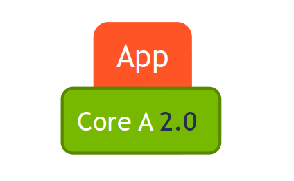]

.alert[Той самий додаток ефективно працює на нових поколіннях ядер.]

.footnote[Джерело слайду: NVIDIA, DLI]

---

class: middle

# Масштабованість

.center.width-90[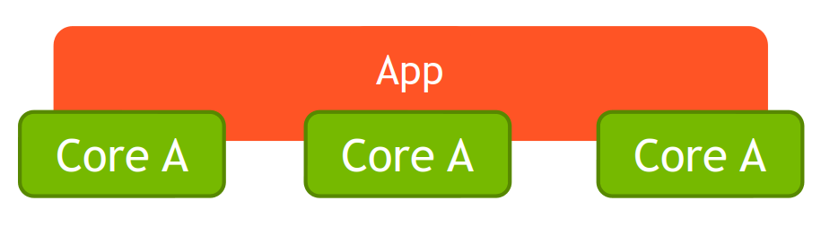]

.alert[Той самий додаток ефективно працює на кількох однакових ядрах.]

.footnote[Джерело слайду: NVIDIA, DLI]

???
Зростання продуктивності з поколіннями апаратного забезпечення (HW) пов'язано:
- Збільшення кількості обчислювальних одиниць (ядер)
- Збільшення кількості потоків
- Збільшення довжини вектора
- Збільшення розміру пакету DRAM
- Збільшення кількості каналів DRAM
- Зменшення затримок переміщення даних

---


class: middle

# Портативність

.center.width-90[]

.alert[Той самий додаток ефективно працює на різних типах ядер.]

.footnote[Джерело слайду: NVIDIA, DLI]

---

class: middle

# Портативність

.center.width-90[]

.alert[Той самий додаток ефективно працює  в системах з різною організацією та інтерфейсами.]

.footnote[Джерело слайду: NVIDIA, DLI]

???
 Потративність між різними типами апаратного забезпечення:
- Між ISAs (Instruction Set Architectures) - X86 vs. ARM (Advanced RISC Machines) тощо
- Між СPU, які орієнтовані на зменшення затримок та графічними процесорами (GPU), які орієнтованих на збільшення пропускної здатності
- Між  моделями паралелізму: VLIW (Very long instruction word ) vs. SIMD (Single instruction, multiple data) vs. потоків
- Між різними  моделями пам’яті: Shared memory vs. distributed memory

---


class: blue-slide, middle, center
count: false

.larger-xx[GPU-прискорені                 
vs                          
лише CPU програми]

---

class: middle

.center.width-110[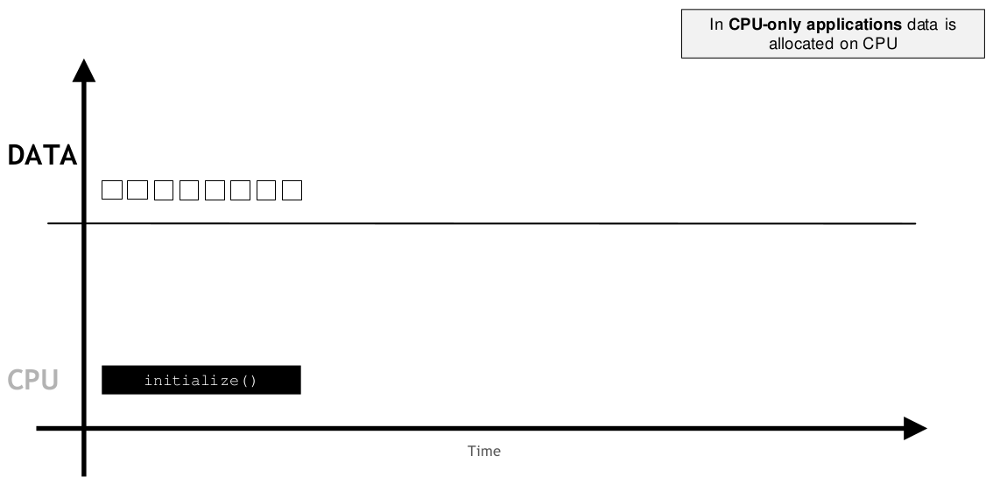]

.footnote[Джерело слайду: NVIDIA, DLI]

---

class: middle

.center.width-110[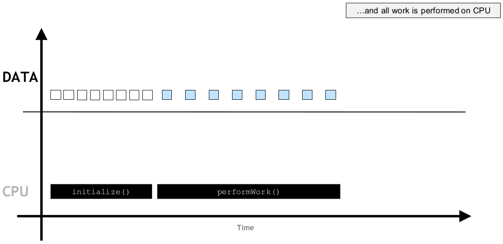]

.footnote[Джерело слайду: NVIDIA, DLI]

---

class: middle

.center.width-110[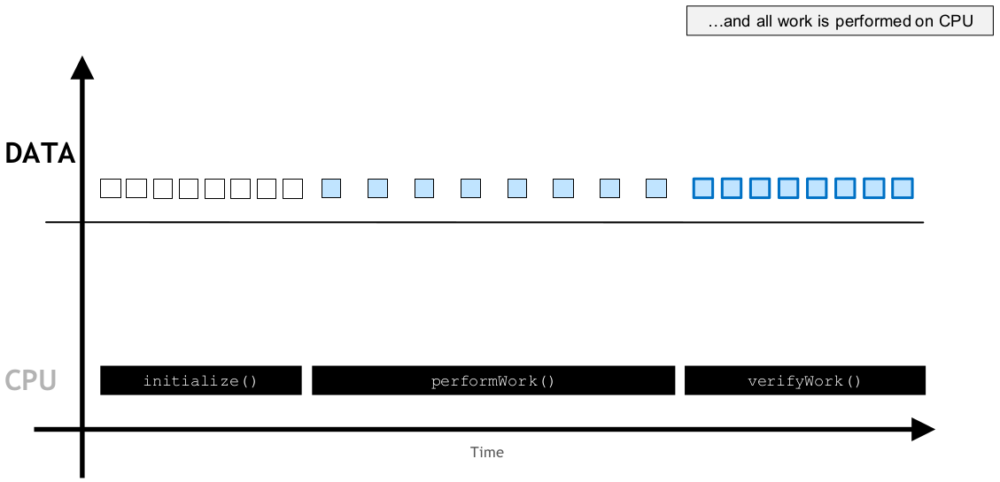]

.footnote[Джерело слайду: NVIDIA, DLI]

---

class: middle

.center.width-110[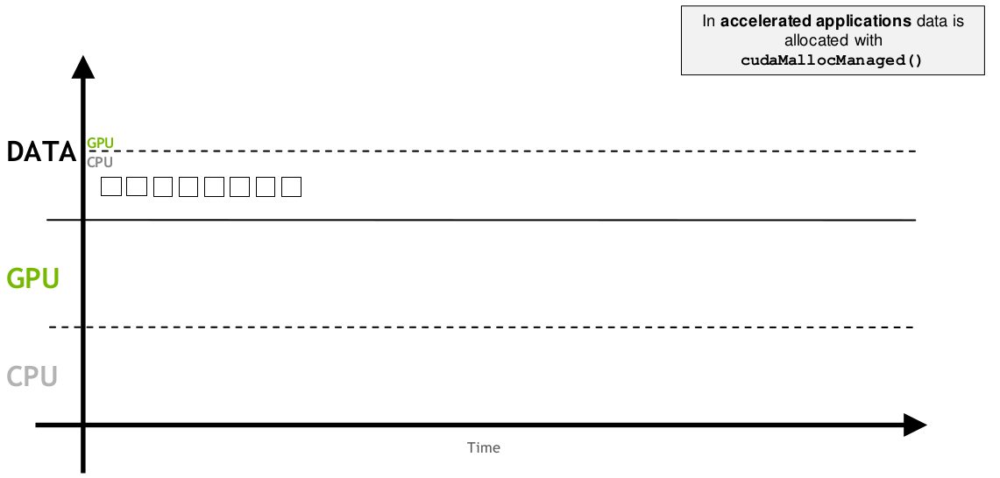]

.footnote[Джерело слайду: NVIDIA, DLI]

---

class: middle

.center.width-110[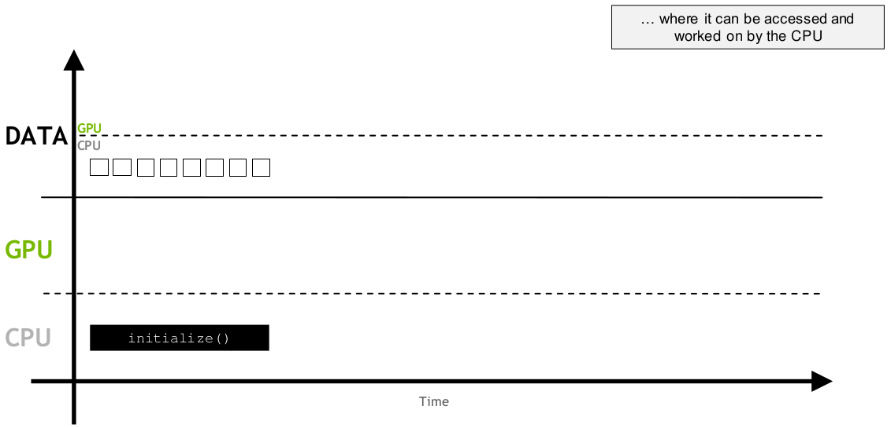]

.footnote[Джерело слайду: NVIDIA, DLI]

---

class: middle

.center.width-110[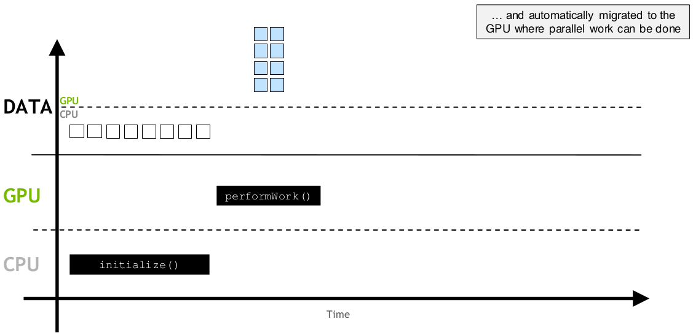]

.footnote[Джерело слайду: NVIDIA, DLI]

---

class: middle

.center.width-110[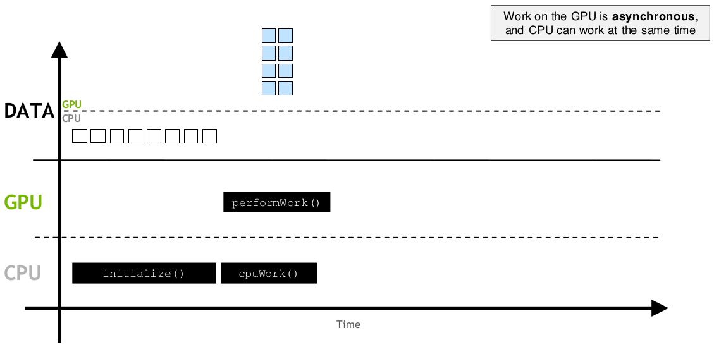]

.footnote[Джерело слайду: NVIDIA, DLI]

---

class: middle

.center.width-110[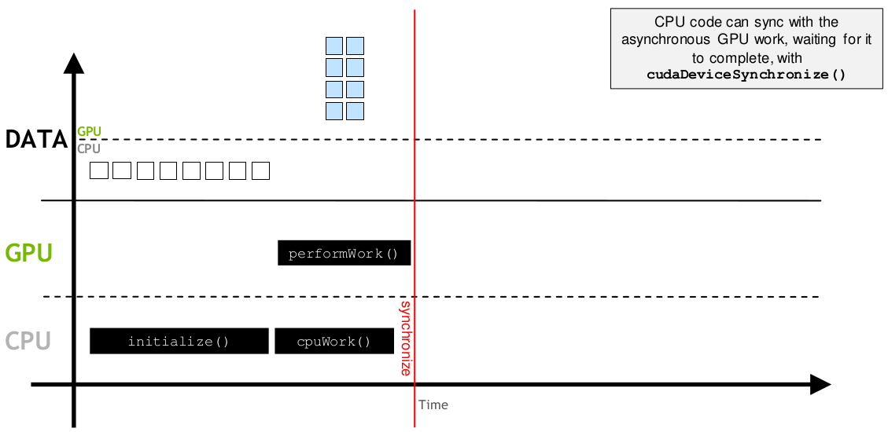]

.footnote[Джерело слайду: NVIDIA, DLI]

---

class: middle

.center.width-110[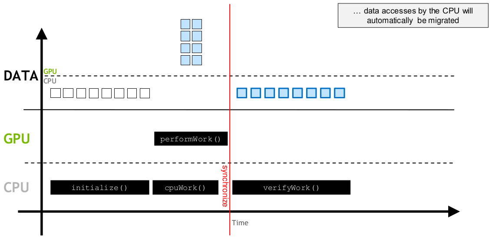]

.footnote[Джерело слайду: NVIDIA, DLI]

---


class: middle

## Способи прискорення виконання програм 
<!-- .smaller-xx[
```c
#include <stdio.h> 

int main() {
  int nDevices;
```
] -->

.center[
.width-100[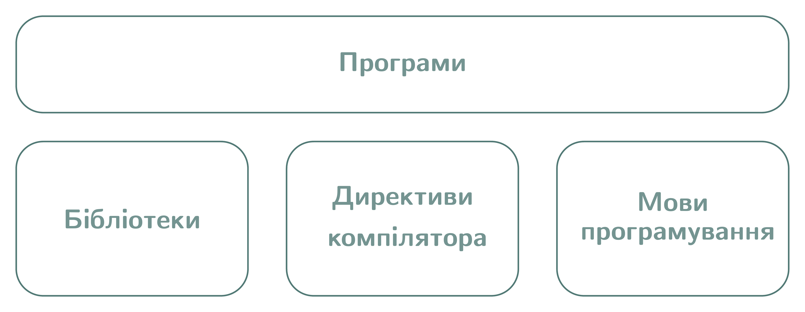]
]

.center.grid[
.smaller-x.kol-1-3[
Прості у використанні  
Висока продуктивність 
]
.smaller-x.kol-1-3[
Прості у використанні  
Портативний код
]

.smaller-x.kol-1-3[
Висока продуктивність   
Висока гнучкість 
]
]

???
Бібліотека (від англ. library) &mdash; це сукупність енергонезалежних ресурсів, які використовуються комп’ютерними програмами, часто для розробки програмного забезпечення. Вони можуть включати дані конфігурації, документацію, довідкові дані, шаблони повідомлень, попередньо написаний код і підпрограми, класи, значення або специфікації типу.


Директиви компілятора &mdash; це інструкції для програми компілятора, які вказують йому, як слід обробляти вихідний текст програми. Досить часто ці інструкції називають директивами препроцесора компілятора, акцентуючи увагу користувачів на тому, що ці директиви виконують обробку вихідного тексту програми, перш ніж компілятор почне генерацію асемблерного тексту програми. Директива препроцесора починаються символом #.

---

class: blue-slide, middle, center
count: false

.larger-xx[Бібліотеки]

---

class: middle

## Бібліотеки: проста, високо-якісне прискорення 

- .bold[*Простота використання:*] використання бібліотек дозволяє прискорювати обчислень на GPU без поглиблених знань програмування GPU 
- Багато бібліотек для прискорення обчислень на GPU дотримуються стандартних API, що дозволяє прискорювати роботу з мінімальними змінами коду
- .bold[*Якість:*] бібліотеки пропонують високоякісні реалізації функцій, які зустрічаються у великій кількості додатків 


---

class:  middle

# Математичні бібліотеки 

.center[
.width-100[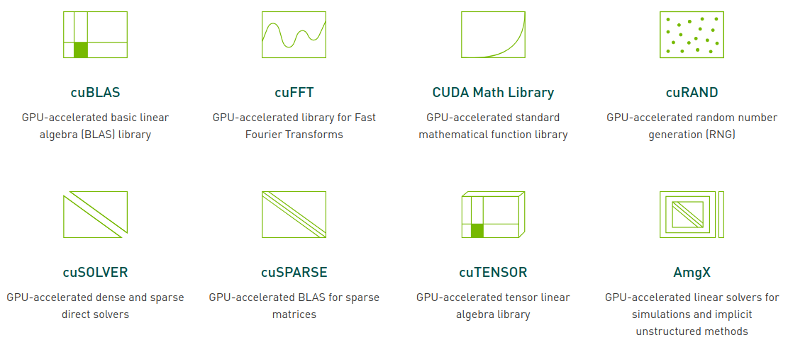]
]


<!--   <div class="divmomentum">
      <iframe class="iframemomentum" src="https://developer.nvidia.com/gpu-accelerated-libraries/" scrolling="no" frameborder="no" style="position:absolute; top:-260px; left: -140px; width:1220px; height: 668px"></iframe>
  </div> -->


.footnote[Джерело слайду: [GPU-Accelerated Libraries](https://developer.nvidia.com/gpu-accelerated-libraries), NVIDIA]

???
Математичні бібліотеки для прискорених обчислень на графічних процесорах закладають основу для інтенсивних обчислень у таких областях, як молекулярна динаміка, обчислювальна гідродинаміка, обчислювальна хімія, медична візуалізація та сейсморозвідка. 

---

class:  middle

## Бібліотеки паралельних алгоритмів
<br>
.center[
.width-40[]

Thrust

Бібліотека паралельних алгоритмів і структур даних C++ з GPU 
]

.footnote[Джерело слайду: [GPU-Accelerated Libraries](https://developer.nvidia.com/gpu-accelerated-libraries), NVIDIA]

???
Thrust &mdash; потужна бібліотека паралельних алгоритмів і структур даних. Виикористання під час вивчення взаємозв’язків у природничих науках, логістиці, плануванні подорожей тощо.

Thrust забезпечує гнучкий інтерфейс високого рівня для програмування на графічному процесорі, що значно підвищує продуктивність розробників. Використовуючи Thrust, розробники C++ можуть написати лише кілька рядків коду для виконання операцій сортування, сканування, перетворення та скорочення з прискореним графічним процесором на порядок швидше, ніж сучасні багатоядерні процесори (CPU). Наприклад, алгоритм **thrust::sort** забезпечує від 5 до 100 разів швидшу продуктивність сортування, ніж STL (Standard Template Library) та TBB (Intel Threading Building Blocks).

Intel Threading Building Blocks (також відома як TBB) - кросплатформова бібліотека шаблонів C++, розроблена компанією Intel для паралельного програмування.  

---

class:  middle

## Бібліотеки візуальної обробки 
<br>

.center[
.width-100[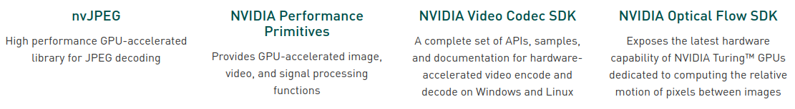]
]

.footnote[Джерело слайду: [GPU-Accelerated Libraries](https://developer.nvidia.com/gpu-accelerated-libraries), NVIDIA]

???
Бібліотеки з прискореним графічним процесором для декодування, кодування та обробки зображень і відео, які використовують CUDA і спеціалізовані апаратні компоненти графічних процесорів. 

---

class:  middle

## Бібліотеки комунікації
<br>

.center[
.width-60[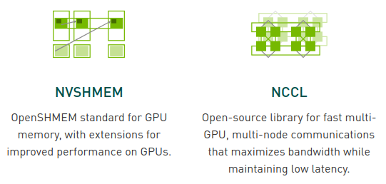]
]

.footnote[Джерело слайду: [GPU-Accelerated Libraries](https://developer.nvidia.com/gpu-accelerated-libraries), NVIDIA]

???
Оптимізовані комунікаційні примітиви для кількох графічних процесорів та багатьох вузлів. 

---

class:  middle

## Бібліотеки глибинного навчання
<br>

.center[
.width-100[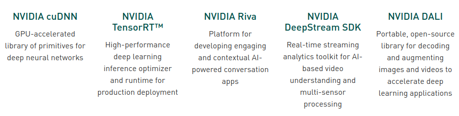]
]

.footnote[Джерело слайду: [GPU-Accelerated Libraries](https://developer.nvidia.com/gpu-accelerated-libraries), NVIDIA]

???
Бібліотеки прискорених обчислень на графічних процесорах для глибинного навчання, які використовують CUDA та спеціалізовані апаратні компоненти графічних процесорів.

---

class: blue-slide, middle, center
count: false

.larger-xx[Директиви компілятора]

---

class:  middle

## Директиви компілятора: проста, портативне прискорення
<br>

- .bold[*Простота використання:*] Компілятор подбає про деталі керування паралелізмом і переміщенням даних 
- .bold[*Портативність:*] Код є загальним, не специфічним для будь-якого типу апаратного забезпечення та може бути розгорнутий на кількох мовах
- .bold[*Невизначеність:*] Продуктивність коду може відрізнятися в різних версіях компілятора 

---


class:  middle

# OpenACC

- Директиви компілятора для С/C++ та Fortran

.bold[Приклад:]

```c
main()
{
    <serial code>
    #pragma acc kernels
    // automatically runs on GPU
    {
        <parallel code>
    } 
}
```
.footnote[Джерело слайду: [OpenACC Directives](https://developer.nvidia.com/openacc/overview), NVIDIA]


???
OpenACC (Open Accelerators) &mdash; програмний стандарт для паралельного програмування, що розробляється y Cray, CAPS, Nvidia і PGI. Стандарт описує набір директив компілятора, призначених для спрощення створення гетерогенних паралельних програм, що задіюють як центральний, так і графічний процесор. 

Прискорені обчислення підживлюють одні з найбільш захоплюючих наукових відкриттів сьогодні. Для вчених і дослідників, які прагнуть швидшої продуктивності додатків, OpenACC забезпечує простий, але потужний підход до використання графічних прискорювачів без докладання значних зусиль з точки зору програмування (незначні модифікації коду).  

---

class: blue-slide, middle, center
count: false

.larger-xx[Мови програмування]

---

class:  middle

## Мови програмування: висока продуктивність та гнучке прискорення
<br>

- .bold[*Продуктивність:*] Програміст може найкраще контролювати паралельність та переміщення даних 
- .bold[*Гнучкість:*] Обчислення не потрібно пристосовувати до обмеженого набору бібліотечних шаблонів або типів директив
- .bold[*Багатослівність:*] Програмісту часто потрібно виразити більше деталей 
---

class:  middle

# Мови програмування GPU
<br>

.center[
.width-100[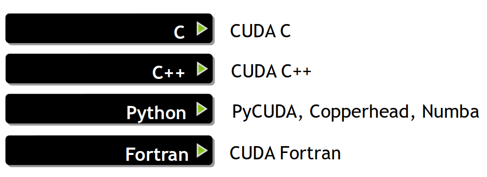]
]

---

class: middle

.center[
.width-90[]
]

.footnote[Джерело слайду: [CUDA C++ Programming Guide](https://docs.nvidia.com/cuda/cuda-c-programming-guide/index.html#fnsrc_1), NVIDIA]

???
CUDA &mdash; абревіатура Compute Unified Device Architecture (Обчислювальна уніфікована архітектура пристрою).

У листопаді 2006 року NVIDIA представила CUDA, платформу для паралельних обчислень загального призначення та модель програмування (general purpose parallel computing platform and programming model), яка використовує механізм паралельних обчислень у графічних процесорах NVIDIA для вирішення багатьох складних обчислювальних проблем більш ефективним способом, ніж на CPU.

CUDA постачається з програмним середовищем, яке дозволяє розробникам використовувати C++ як мову програмування високого рівня. Як показано на цьому слайді, CUDA підтримує також інші мови, інтерфейси прикладного програмування або підходи на основі директив, такі як FORTRAN, DirectCompute, OpenACC. 

Поява багатоядерних процесорів і багатоядерних графічних процесорів означає, що чіпи основних процесорів тепер є паралельними системами. Завдання полягає в тому, щоб розробити прикладне програмне забезпечення, яке прозоро масштабує свою паралельність. Модель паралельного програмування CUDA розроблена для подолання цієї проблеми.

У його основі три ключові абстракції: ієрархія груп потоків, спільна пам’ять (shared memories) і синхронізація бар’єрів (barrier synchronization), які просто надаються програмісту як мінімальний набір мовних розширень.

---

class: blue-slide, middle, center
count: false

.larger-xx[Приклади паралельних обчислень]

---

class: middle

## Перетворення RGB зображення у відтінки сірого
.center[
.width-100[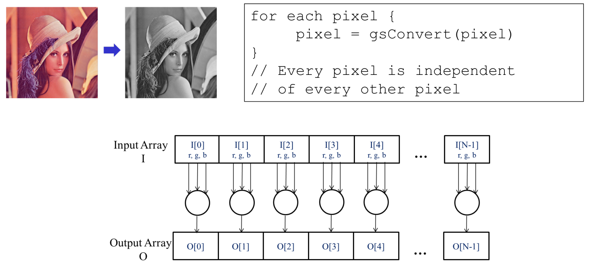]
]

$$\boxed{O = r \cdot 0.21 + g \cdot 0.72 + b \cdot 0.07}$$

.footnote[Джерело слайду: [Applied Parallel Programming](https://wiki.illinois.edu/wiki/download/attachments/740033143/ece408-lecture2-CUDA-introduction-sjp-FL21.pdf?version=1&modificationDate=1629984366000&), David Kirk and Wen-mei W. Hwu]

???
Для ілюстрацій ключових концепцій написання масштабованих паралельних програм буде використана проста мова, яка підтримує масивний паралелізм і гетерогенні обчислення &mdash; CUDA C. CUDA C розширює популярну мову програмування C з мінімальним новим синтаксисом та інтерфейсами, це дозволяє програмістам сконцентруватись на гетерогенних обчислювальних системах, які містять як ядра CPU, так і масивно паралельні графічні процесори (GPUs). Як випливає з назви, CUDA C побудована на платформі CUDA NVIDIA. CUDA широко використовується в індустрії високопродуктивних обчислень, у найпоширеніших операційних системах доступні такі інструменти, як компілятори, налагоджувачі (debuggers) та профілювання (Profiling - інструмент, який дозволяє зрозуміти та оптимізувати продуктивність CUDA).

Visual Profiler &mdash; це інструмент графічного профілювання, який відображає часову шкалу активності CPU та GPU вашої програми, а також включає автоматичний механізм аналізу для визначення можливостей оптимізації.


Коли сучасні програми працюють повільно, проблема зазвичай полягає в тому, що подано занадто багато даних для обробки. Користувацькі програми маніпулюють зображеннями або відео від мільйонів до трильйонів пікселів. Наукові програми моделюють гідродинаміку, використовуючи сітки на мільярди обчислювальних вузлів. Додатки молекулярної динаміки повинні моделювати взаємодії між тисячами й мільйонами атомів. Планування авіакомпаній стосується тисяч рейсів, екіпажів і виходів до аеропорту. Важливо, що більшість із цих пікселів, частинок, вузлів сіток, взаємодій, польотів тощо можна розглядати в основному незалежно. 

Для перетворення кольорового пікселя в градацію сірого потрібні лише дані цього пікселя. Пікселі можна обчислювати незалежно один від одного під час такого перетворення. 

---

class: middle

# Додавання векторів
.center[
.width-100[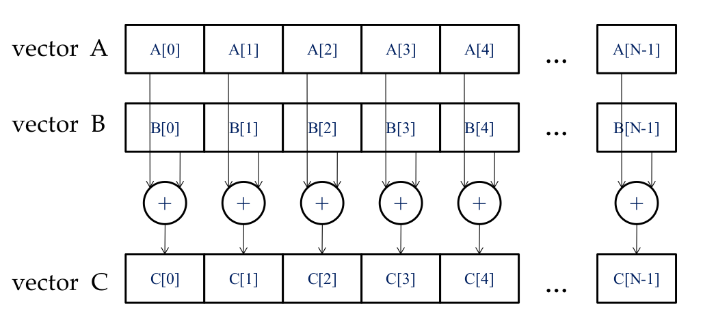]
]

---


class: middle

## Процес компіляції CUDA C/C++

- Типовий код CUDA C/C++: *хост (CPU) + пристрій (GPU)*

.center.width-70[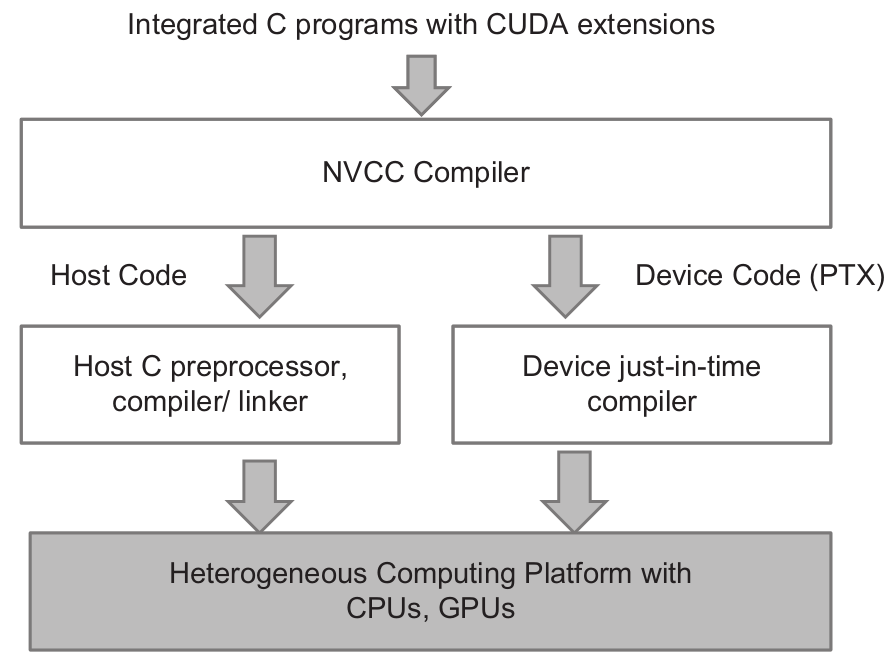]
    

.footnote[Джерело слайду: Programming Massively Parallel Processors, David Kirk and Wen-mei W. Hwu]

???
Тепер ми готові до того, щоб почати вчитися писати програми з CUDA C/C++, які б використовували паралелізм даних для швидшого виконання. Структура програми CUDA C відображає співіснування хоста-host (CPU) і одного або кількох пристроїв-devices (GPU) в комп’ютері. 

Кожен вихідний файл CUDA може містити комбінацію коду хоста та пристрою. За замовчуванням будь-яка традиційна програма C/C++ є програмою CUDA, яка містить лише код хоста. Можна додати функції пристрою та оголошення даних у будь-який вихідний файл. Функції або оголошення даних для пристрою чітко позначені спеціальними ключовими словами CUDA C. Це функції, які використовують великий паралелізм даних для прискорення виконання програм. 

Після того, як функції пристрою та оголошення даних додані до вихідного файлу, вони більше не прийнятні для традиційного компілятора C. Код повинен бути скомпільований компілятором, який розпізнає та розуміє ці додаткові оголошення. Ми будемо використовувати компілятор під назвою NVCC (NVIDIA C Compiler). 

Як показано на рисунку, компілятор NVCC обробляє програму CUDA C, використовуючи ключові слова CUDA, щоб розділити код хоста та код пристрою. Код хоста &mdash; це прямий код C ANSI, який додатково компілюється за допомогою стандартних компіляторів C/C++ хоста і виконується як традиційний процес CPU. Код пристрою позначений ключовими словами CUDA для паралельних функцій даних, які називаються ядрами, і пов'язаних з ними допоміжними функціями і структурами даних. Код пристрою далі компілюється компонентом NVCC і виконується на пристрої GPU. У ситуаціях, коли немає доступного апаратного пристрою або якщо ядро може виконуватися на CPU, тоді можна вибрати виконання цього ядра на CPU за допомогою такого інструменту, як MCUDA. 

---

class: middle

## CUDA/OpenCL &mdash; модель виконання 

- Послідовні або помірно паралельні частини в коді, що виконуються **хостом** 
- Високо паралельні частини в коді, що виконуються **пристроєм**: ядро 

.width-100[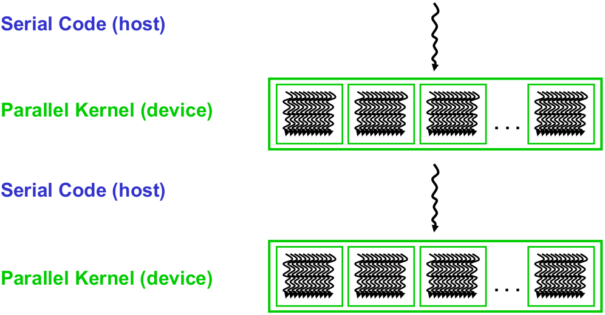]

.footnote[Джерело слайду: [Applied Parallel Programming](https://wiki.illinois.edu/wiki/download/attachments/740033143/ece408-lecture2-CUDA-introduction-sjp-FL21.pdf?version=1&modificationDate=1629984366000&), David Kirk and Wen-mei W. Hwu]

???
OpenCL (Open Computing Language) &mdash; це фреймворк для написання програм, які виконуються на різнорідних платформах, що складаються з центральних процесорів (CPU), графічних процесорів (GPU), цифрових сигнальних процесорів (DSP), програмованих логічних матриць (FPGA) та інших процесорів або апаратних прискорювачів. 

Виконання програми CUDA показано на цьому рисунку. Виконання починається з коду хоста (CPU serial code). Коли функція ядра (паралельний код пристрою) викликається або запускається, вона виконується великою кількістю потоків на пристрої. Усі потоки, які генеруються запуском ядра, спільно називаються сіткою (grid).

Ці потоки є основним механізмом паралельного виконання на платформі CUDA. На цьому рисунку показано виконання двох сіток потоків. Незабаром ми обговоримо, як ці сітки організовані. Коли всі потоки ядра завершують виконання, відповідна сітка завершується, далі виконання продовжується на хості, доки не буде запущено інше ядро. Зверніть увагу, що тут показана спрощена модель, де виконання на CPU і виконання на GPU не перекриваються. Багато гетерогенних обчислювальних програм фактично керують виконанням CPU та GPU, що перекриваються, щоб скористатися перевагами як CPU, так і GPU. 

---

class: middle

# Ядра (Kernels)

- Ядро визначається за допомогою специфікатора ``` __global__```

```C

// Kernel definition
__global__ void VecAdd(float* A, float* B, float* C)
{
int i = threadIdx.x;
C[i] = A[i] + B[i];
}
int main()
{
...
// Kernel invocation with N threads
VecAdd<<<1, N>>>(A, B, C);
...
}
```
.footnote[Джерело слайду: [Programming Model](https://docs.nvidia.com/cuda/cuda-c-programming-guide/index.html#programming-model), CUDA Toolkit v11.6.0]

???
CUDA C/C++ розширює C/C++, дозволяючи програмісту визначати функції (ядра), які при виклику виконуються N разів паралельно N різними потоками CUDA, на відміну від звичайних функцій, які виконуються лише один раз. 

Ядро визначається за допомогою специфікатора декларації __global__, а кількість потоків CUDA, які будуть виконані цим ядром, вказується за допомогою нового синтаксису конфігурації виконання <<<...>>>.  Кожному потоку, який виконує ядро, надається унікальний ідентифікатор потоку, доступний у ядрі через вбудовані змінні. 

Тут кожен з N потоків, які виконують VecAdd(), виконує одне попарне додавання. 

---


class: middle

# Ієрархія потоків

.width-95[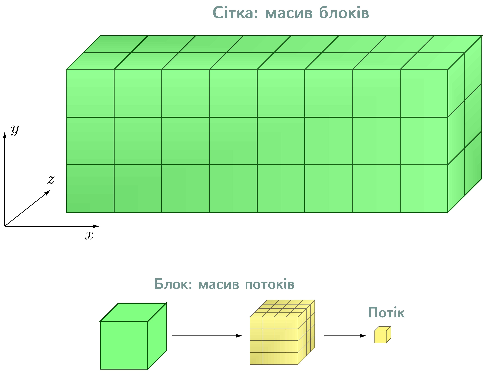]

---

class: middle

# $\texttt{gridDim}$ 

Кількість блоків у кожному вимірі:
- $\texttt{gridDim.x} = 8$
- $\texttt{gridDim.y} = 3$ 
- $\texttt{gridDim.z} = 2$   

.center.width-70[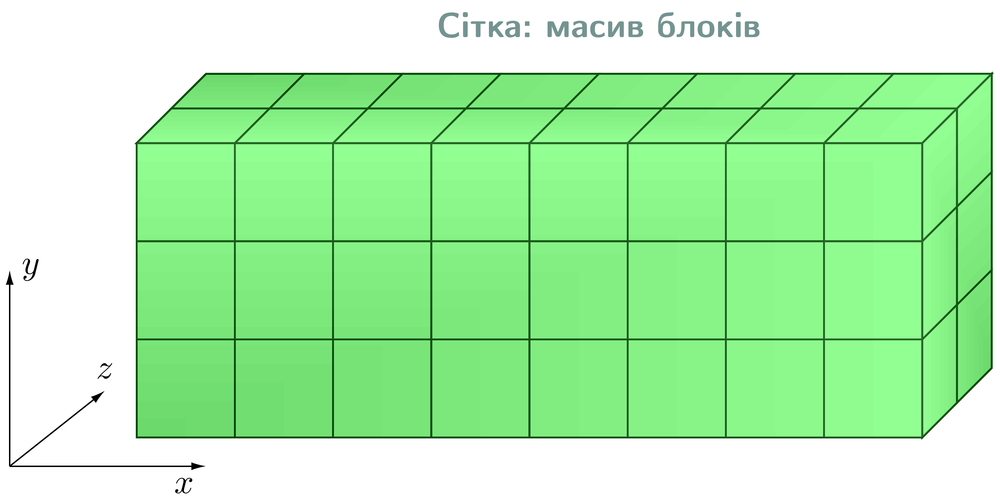]

---

class: middle

# $\texttt{blockIdx}$ 

Кожен блок має унікальний індекс у сітці:
- $\texttt{blockIdx.x} \;\;$  (від $0$ до $\texttt{gridDim.x} -1$)
- $\texttt{blockIdx.y} \;\;$  (від $0$ до $\texttt{gridDim.y} -1$)
- $\texttt{blockIdx.z} \;\;$  (від $0$ до $\texttt{gridDim.z} -1$)

.center.width-70[]

---

class: middle

# $\texttt{blockDim}$ 

Кількість потоків у блоці:
- $\texttt{blockDim.x} = 4$  
- $\texttt{blockDim.y} = 4$  
- $\texttt{blockDim.z} = 4$  

.center.width-100[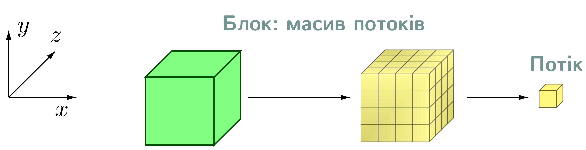]

---


class: middle

# $\texttt{threadIdx}$ 

Кожен потік має унікальний індекс у блоці:
- $\texttt{threadIdx.x} \;\;$  (від $0$ до $\texttt{blockDim.x} -1$)
- $\texttt{threadIdx.y} \;\;$  (від $0$ до $\texttt{blockDim.x} -1$)
- $\texttt{threadIdx.z} \;\;$  (від $0$ до $\texttt{blockDim.x} -1$)

.center.width-100[]

???

Кожен threadIdx унікальний для кожного потоку у рамках одного блоку. threadIdx та blockIdx унікальний для кожного потоку у рамках сітки.

---

class: blue-slide, middle, center
count: false

.larger-xx[Приклад: одновимірний випадок]

---

class: middle

.center.width-110[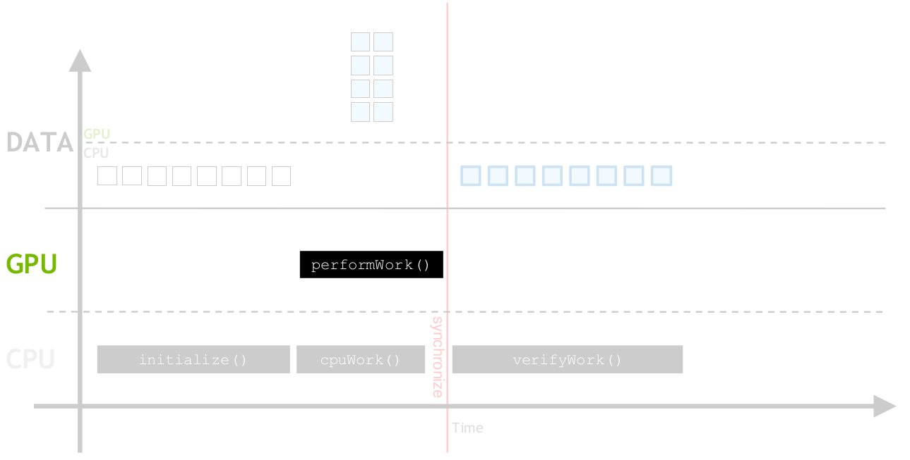]

.footnote[Джерело слайду: NVIDIA, DLI]

---

class: middle

.smaller-x[Для виконання ядра потрібно вказати *кілікість блоків* та *кількість потоків* в одному блоці]

.center.width-90[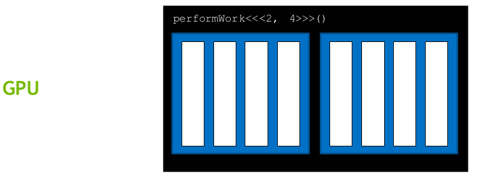]

.footnote[Джерело слайду: NVIDIA, DLI]

---

class: middle

.smaller-x[$\texttt{gridDim.x}$ визначає кількість блоків у сітці, у цьому випадку $\texttt{gridDim.x} = 2$]

.center.width-90[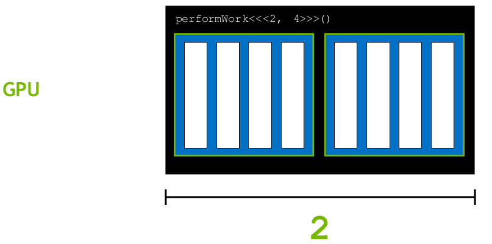]

.footnote[Джерело слайду: NVIDIA, DLI]

---

class: middle

.smaller-x[$\texttt{blockIdx.x}$ визначає поточний індекс блоку у сітці, у цьому випадку $\texttt{blockIdx.x} = 0$]

.center.width-90[]

.footnote[Джерело слайду: NVIDIA, DLI]

---

class: middle

.smaller-x[$\texttt{blockIdx.x}$ визначає поточний індекс блоку у сітці, у цьому випадку $\texttt{blockIdx.x} = 1$]

.center.width-90[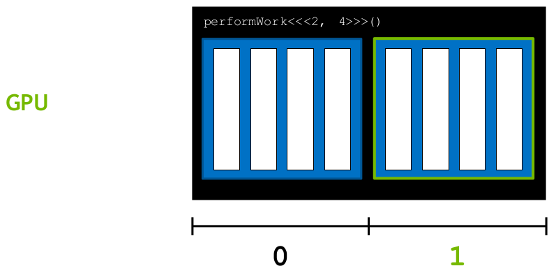]

.footnote[Джерело слайду: NVIDIA, DLI]

---

class: middle

.smaller-x[$\texttt{blockDim.x}$ визначає кількість потоків у блоці, у цьому випадку $\texttt{blockDim.x} = 4$]

.center.width-90[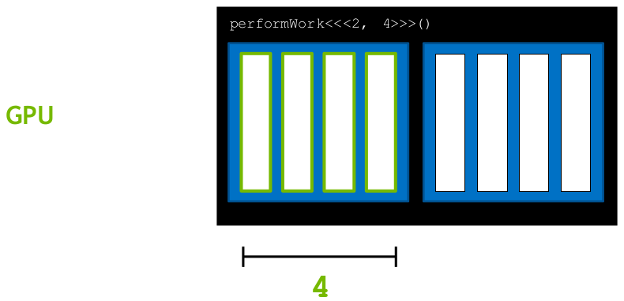]

.footnote[Джерело слайду: NVIDIA, DLI]

---

class: middle

.smaller-x[Усі блоки у сітці містять **однакову** кількість потоків]

.center.width-90[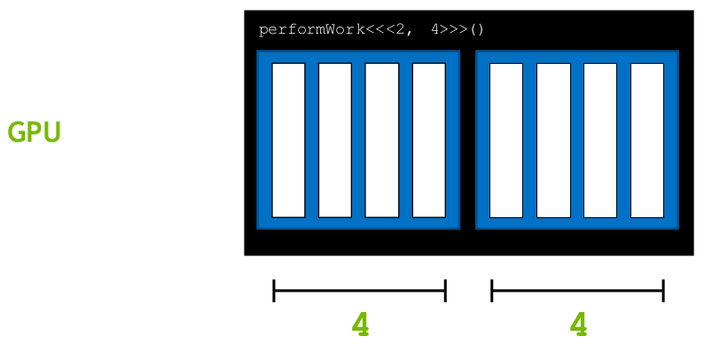]

.footnote[Джерело слайду: NVIDIA, DLI]

---

class: middle

.smaller-x[$\texttt{threadIdx.x}$ визначає індекс потоку у межах одного блоку, у цьому випадку $\texttt{threadIdx.x} = 0$]

.center.width-90[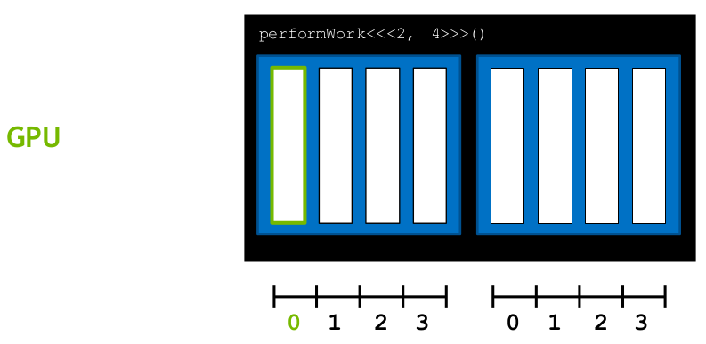]

.footnote[Джерело слайду: NVIDIA, DLI]

---

class: middle

.smaller-x[$\texttt{threadIdx.x}$ визначає індекс потоку у межах одного блоку, у цьому випадку $\texttt{threadIdx.x} = 1$]

.center.width-90[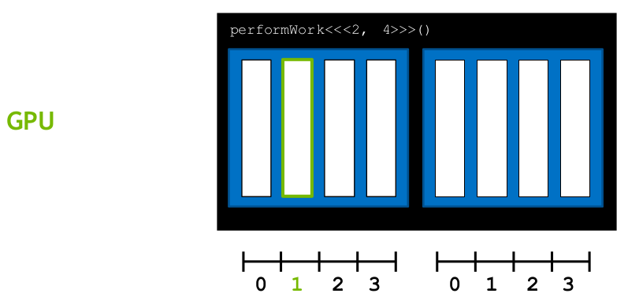]

.footnote[Джерело слайду: NVIDIA, DLI]

---


class: middle

.smaller-x[$\texttt{threadIdx.x}$ визначає індекс потоку у межах одного блоку, у цьому випадку $\texttt{threadIdx.x} = 2$]

.center.width-90[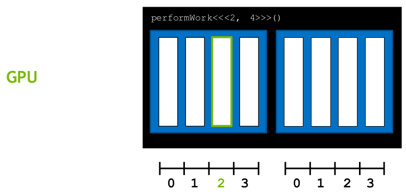]

.footnote[Джерело слайду: NVIDIA, DLI]

---

class: middle

.smaller-x[$\texttt{threadIdx.x}$ визначає індекс потоку у межах одного блоку, у цьому випадку $\texttt{threadIdx.x} = 3$]

.center.width-90[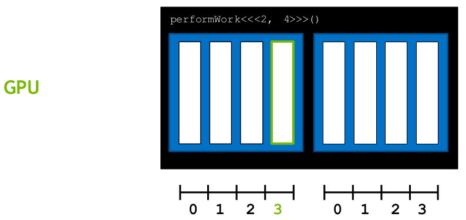]

.footnote[Джерело слайду: NVIDIA, DLI]

---

class: middle

.smaller-x[$\texttt{threadIdx.x}$ визначає індекс потоку у межах одного блоку, у цьому випадку $\texttt{threadIdx.x} = 0$]

.center.width-90[]

.footnote[Джерело слайду: NVIDIA, DLI]

---

class: middle

.smaller-x[$\texttt{threadIdx.x}$ визначає індекс потоку у межах одного блоку, у цьому випадку $\texttt{threadIdx.x} = 1$]

.center.width-90[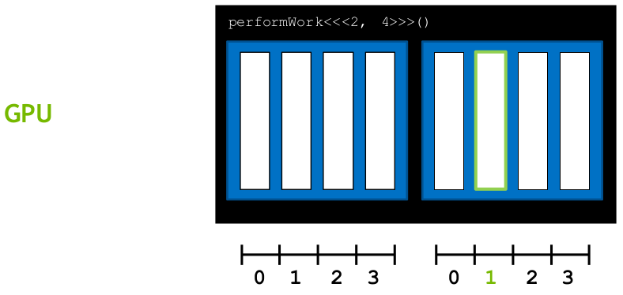]

.footnote[Джерело слайду: NVIDIA, DLI]

---

class: middle

.smaller-x[$\texttt{threadIdx.x}$ визначає індекс потоку у межах одного блоку, у цьому випадку $\texttt{threadIdx.x} = 2$]

.center.width-90[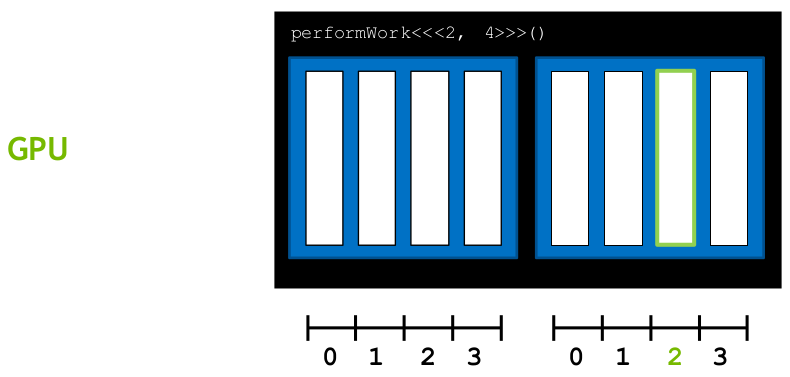]

.footnote[Джерело слайду: NVIDIA, DLI]

---

class: middle

.smaller-x[$\texttt{threadIdx.x}$ визначає індекс потоку у межах одного блоку, у цьому випадку $\texttt{threadIdx.x} = 3$]

.center.width-90[]

.footnote[Джерело слайду: NVIDIA, DLI]

---


class: blue-slide, middle, center
count: false

.larger-xx[Демо: запит пристрою]

<a href="https://colab.research.google.com/github/YKochura/ac-kpi/blob/main/tutor/lec2/DeviceQuery.ipynb" target="_parent"></a>

---

class: blue-slide, middle, center
count: false

.larger-xx[Демо: додавання векторів]

<a href="https://colab.research.google.com/github/YKochura/ac-kpi/blob/main/tutor/lec2/vectAdd.ipynb" target="_parent"></a>

---


# Додаток


- NVIDIA, [CUDA Quick Start Guide](https://docs.nvidia.com/cuda/cuda-quick-start-guide/index.html)

---


class: end-slide, center
count: false

.larger-xx[Кінець 🏁]