class: middle, center, title-slide 
 
# Технології графічного процесінгу

Лекція 4: Моделі паралелізму

  
Кочура Юрій Петрович 
[iuriy.kochura@gmail.com](mailto:iuriy.kochura@gmail.com)  
<a href="https://t.me/y_kochura">@y_kochura</a>  

???
Прискорене обчислення на графічних процесорах (GPU) — це використання спеціалізованого комп’ютерного обладнання, графічного процесора, для виконання певних типів обчислень набагато швидше, ніж на центральному процесорі загального призначення (CPU).

У той час як центральні процесори розроблені для виконання широкого кола завдань, графічні процесори оптимізовані для обробки великих обсягів даних і виконання паралельних обчислень. Це робить графічні процесори ідеальними для таких завдань, як обробка графіки, наукове моделювання, машинне навчання та інші задачі, що потребують обробки великих даних.

У прискорених обчисленнях на графічному процесорі графічний процесор використовується для розвантаження частини обробки з центрального процесора з метою прискорення певних обчислень. Це робиться шляхом розбиття обчислення на безліч менших частин, які можуть оброблятися паралельно багатьма процесорними ядрами в GPU. Завдяки цьому обчислення, які могли тривати години або дні на центральному процесорі, можуть бути завершені за кілька хвилин або навіть секунд на графічному процесорі.

Загалом, прискорені обчислення на графічних процесорах дають змогу значно пришвидшити певні типи обчислень, за рахунок спеціалізованих можливостей графічних процесорів.

---

class: middle

# Сьогодні

Мета &mdash; дізнатися, як ядро CUDA використовує ресурси апаратного забезпечення

- Основні причини використання паралельного програмування
- Таксономія Флінна 
- Призначення блоків потоків на ресурси виконання 
- Обмеження потужності ресурсів виконання
- Планування потоків без накладних витрат

???
Таксономія (Класифікація) Флінна (Flynn's taxonomy) — загальна класифікація архітектур ЕОМ за ознаками наявності паралелізму в потоках команд (інструкцій) і даних.

---

class: blue-slide, middle, center
count: false

.larger-xx[Основні причини використання паралельного програмування]

---

class: middle, center

# ЕКОНОМІЯ ЧАСУ ТА/АБО ГРОШЕЙ

.width-100[]

???
1. Теоретично, виділення додаткових ресурсів на виконання завдання скоротить час його виконання з потенційною економією коштів.
1. Комп'ютери, які підтримують високу ступінь паралельності обчислень, можна побудувати з дешевих, товарних компонентів.

---

class: middle,

# ВИРІШЕННЯ БІЛЬШИХ / СКЛАДНІШИХ ЗАДАЧ

1. Багато задач настільки великі та/або складні, що їх недоцільно або неможливо розв’язати за допомогою послідовної програми, особливо враховуючи обмежену пам’ять комп’ютера.
- Приклад: [Грандіозні завдання - Grand Challenges](en.wikipedia.org/wiki/Grand_Challenge), які потребують петафлопси і петабайти обчислювальних ресурсів.
- Приклад: веб-пошукові системи/бази даних обробляють мільйони транзакцій щосекунди.

???
Грандіозні завдання – складні, але важливі проблеми, які ставляться різними установами чи професіями для заохочення рішень чи підтримки використання державних чи благодійних фондів, особливо у найбільш високорозвинених країнах та активізувати не тільки наукову та інженерну спільноту, а й студентів, журналістів, громадськість та їх обраних представників, щоб розвинути почуття можливостей, розуміння ризиків та невідкладну відданість прискоренню прогресу. 

**В уряді та збройних силах**

- DARPA Grand Challenge, ініціатива з розробки технологій, необхідних для створення повністю автономних наземних транспортних засобів, здатних пройти значний курс бездоріжжя за обмежений час. 
- DARPA Urban Challenge, частина Grand Challenge DARPA, але для міських територій. 
- H-Prize, ініціатива за підтримки Міністерства енергетики США (DOE) щодо просування використання водню як енергоносія.

**В медицині та здоров'я**
- Ініціатива BRAIN, дослідження мозку через просування інноваційних нейротехнологій, підтримуючи розробку та застосування технологій для розуміння функцій людського мозку.
- Великі проблеми глобальної охорони здоров'я, дослідницька ініціатива, запущена Фондом Білла та Мелінди Гейтс для пошуках рішень проблем зі здоров'ям у країнах, що розвиваються.

**В науці та технологіях**
- Ліфт: 2010, ініціатива, частково за підтримки НАСА з метою розробки космічних ліфтів та технологій, пов'язаних із космічними ліфтами.

---

class: middle

# КОНКУРЕНТНІСТЬ

- Один обчислювальний ресурс може виконувати лише одну дію одночасно. Кілька обчислювальних ресурсів можуть виконувати багато дій одночасно.

---

class: middle

# ВІДДАЛЕНІ РЕСУРСИ

- Використання обчислювальних ресурсів у мережі або навіть Інтернеті, коли локальних обчислювальних ресурсів недостатньо.

---

class: middle

# ВИКОРИСТАННЯ 

- Сучасні комп’ютери, навіть ноутбуки, мають паралельну архітектуру апаратного забезпечення з кількома процесорами/ядрами.
- Паралельне програмне забезпечення спеціально призначене для паралельного апаратного забезпечення з кількома ядрами, потоками тощо.
- У більшості випадків послідовні програми, що виконуються на сучасних комп'ютерах, «марно витрачають» потенційну обчислювальну потужність.

---

class: blue-slide, middle, center
count: false

.larger-xx[Таксономія Флінна]

---

class: middle

# Таксономія Флінна

.center.width-40[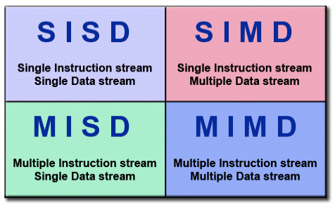]

- Існує кілька [різних способів](https://hpc.llnl.gov/sites/default/files/parallelClassifications_0.pdf) класифікації паралельних комп’ютерів
- Одна з найбільш поширених класифікацій, яка використовується з 1966 року, називається таксономією Флінна
- Таксономія Флінна розрізняє багатопроцесорні комп'ютерні архітектури відповідно до того, як їх можна класифікувати за двома незалежними вимірами: *потоку команд (Instruction Stream)* та  *потоку даних (Data Stream)*. Кожен із цих вимірів може мати лише один із двох можливих станів: *одиничний (Single)* або *множинний (Multiple)*

.footnote[Джерело слайду:  Lawrence Livermore National Laboratory]

???

Наведена на цьому слайді матриця визначає 4 можливі класифікації за Флінном

---

class: middle

# Single Instruction, Single Data (SISD)

.center.width-100[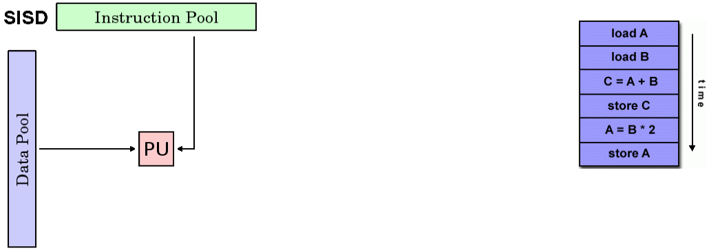]

.footnote[Джерело слайду:  Lawrence Livermore National Laboratory]

???
SISD (single instruction, single data — одиночний потік команд, одиночний потік даних) — елемент класифікації згідно з таксономією Флінна для архітектури з послідовним виконанням інструкцій.

- Послідовний (непаралельний) комп'ютер
- Одна інструкція (Single Instruction): CPU обробляє лише один потік інструкцій протягом будь-якого такту
- Окремі дані (Single Data): лише один потік даних використовується як вхід протягом кожного тактового циклу
- Детерміноване виконання
- Це найстаріший вид комп'ютера
- Приклади: мейнфрейми старого покоління, міні-комп’ютери, робочі станції та однопроцесорні/ядерні ПК.
---

class: middle

# Single Instruction, Multiple Data (SIMD)

.center.width-100[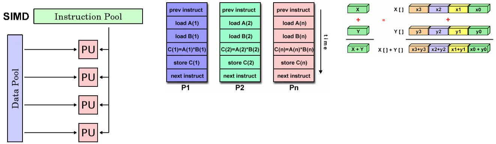]

.footnote[Джерело слайду:  Lawrence Livermore National Laboratory]

???
SIMD (single instruction, multiple data — одиночний потік команд, множинний потік даних) — це елемент класифікації згідно з таксономією Флінна для паралельних процесорів, де до багатьох елементів даних виконується одна або однакові команди.

- Різновид паралельного комп'ютера
- Одна інструкція (Single Instruction):  усі процесори (processing units - PU) виконують одну і ту ж інструкцію за будь-який заданий такт
- Множинний потік даних (Multiple Data):  кожен процесор може працювати з різними елементами даних
- Найкраще підходить для спеціалізованих задач, що характеризуються високим ступенем регулярності (здійснюється систематично), наприклад для обробки графіки/зображень.
- Синхронне та детерміноване виконання
-  Два різновиди: процесорні масиви (Processor Arrays) та векторні конвеєри (Vector Pipelines)
  - Процесорні масиви: Thinking Machines CM-2, MasPar MP-1 & MP-2, ILLIAC IV
  - Векторні конвеєри: IBM 9000, Cray X-MP, Y-MP & C90, Fujitsu VP, NEC SX-2, Hitachi S820, ETA10
- Більшість сучасних комп’ютерів, особливо з графічними процесорами (GPU), використовують модель паралелізму SIMD.
---

class: middle

# Multiple Instruction, Single Data (MISD)

.center.width-90[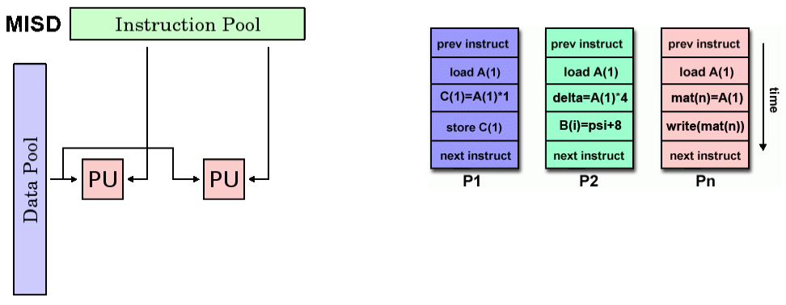]

.footnote[Джерело слайду:  Lawrence Livermore National Laboratory]

???
MISD (multiple instruction, single data — множинний потік команд, одиночний потік даних) — це елемент класифікації згідно з таксономією Флінна де декілька функціональних модулів виконують різні операції над даними, це архітектура для паралельних обчислень.

- Різновид паралельного комп'ютера
- Множинний потік команд (Multiple Instruction):  Кожен процесор працює з даними незалежно через окремі потоки інструкцій.
- Одиночний потік даних (Single Data):  Один потік даних подається в кілька блоків обробки.
- Існує небагато (якщо такі є) реальних прикладів такого класу паралельних комп’ютерів.
- Деякі можливі варіанти використання:
  - кілька частотних фільтрів, що працюють на одному потоці сигналу
  - кілька криптографічних алгоритмів, які намагаються зламати одне закодоване повідомлення

---

class: middle

# Multiple Instruction, Multiple Data (MIMD)

.center.width-100[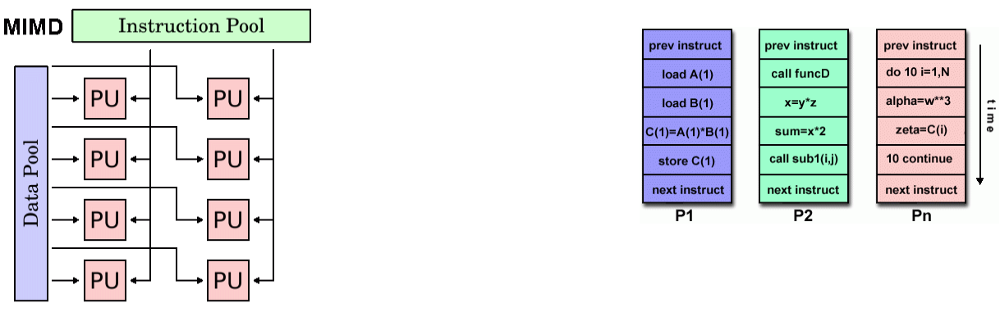]

.footnote[Джерело слайду:  Lawrence Livermore National Laboratory]

???
MIMD (multiple instruction, multiple data — множинний потік команд, множинний потік даних) — це елемент класифікації згідно з таксономією Флінна для паралельних процесорів, де є декілька обчислювальних пристроїв обробки команд, кожен з яких працює зі своїм набором команд.

- Різновид паралельного комп'ютера
- Множинний потік команд (Multiple Instruction):  Кожен процесор може виконувати різні потоки інструкцій
- Множинний потік даних (Multiple Data): Кожен процесор може працювати з різними потоками даних
- Виконання може бути синхронним або асинхронним, детермінованим або недетермінованим
- В даний час до цієї категорії відносяться більшість сучасних суперкомп'ютерів.
- Приклади:
  -  більшість сучасних суперкомп'ютерів, мережеві паралельні комп'ютерні кластери та "грід системи", комп'ютери на симетричних мультипроцесорах (SMP), багатоядерні ПК
- Багато архітектур MIMD також включають підкомпоненти виконання SIMD

Симетричне мультипроцесування (англ. Symmetric Multiprocessing, або SMP) — це архітектура багатопроцесорних комп'ютерів, в якій два або більше однакових процесорів підключаються до загальної пам'яті. Більшість багатопроцесорних систем сьогодні використовують архітектуру SMP.

SMP-системи дозволяють будь-якому процесору працювати над будь-яким завданням незалежно від того, де в пам'яті зберігаються дані для цього завдання; за належної підтримки операційною системою, SMP-системи можуть легко переміщувати завдання між процесорами ефективно розподіляючи навантаження. 

---

class: blue-slide, middle, center
count: false

.larger-xx[Призначення блоків потоків на ресурси виконання]

---

class: middle

# Прозора масштабованість

.center.width-100[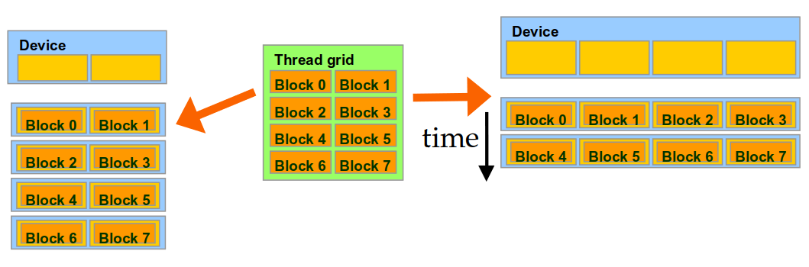]

- Блоки виконуються в довільному порядку
- Пристрій може в будь-який час призначити блок будь-якому потоковому процесору 
- Ядро масштабується на будь-яку кількість паралельних процесорів

.footnote[Джерело слайду: NVIDIA, DLI]

???
Streaming Multiprocessors (SM) - Потокові мультипроцесори

https://stackoverflow.com/questions/3519598/streaming-multiprocessors-blocks-and-threads-cuda

---

class: middle

# Приклад: Виконання блоку потоків

.grid[
.smaller-xx.kol-2-3[
- Потоки утворюють блоки, які передаються на виконання *Потоковим мультипроцесорам - Streaming Multiprocessors (SM)*
- Кожен мультипроцесор може обробити до 32 блоків, якщо дозволяє ресурс
- В архітектурі Volta мультипроцесор може взяти до 2048 потоків, або
  - 256 (потоків на блок) * 8 блоків
  - 512 (потоків на блок) * 4 блоки, і т.д.
- Доступ до індексів потоків та блоків забезпечує SM
- SM управляє/планує виконання потоків

]

.center.kol-1-3[ 
.width-100[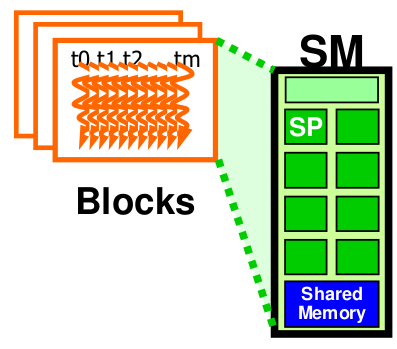]

]
]
---

class: middle

# Від природної мови до електронів

.center.width-100[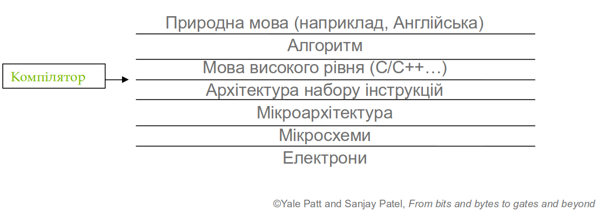]

.footnote[Джерело слайду: NVIDIA, DLI]

---

class: middle

# Модель фон Неймана

.grid[
.center.kol-1-2[
.center.width-100[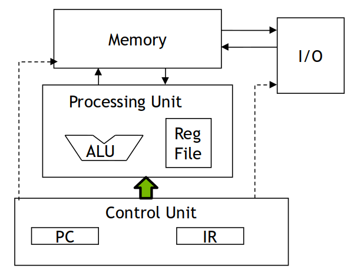]

Потік &mdash; це "віртуальний" або "абстрактний" процесор фон Неймана
]

.center.kol-1-2[ 
.width-50[]

Джон фон Нейман

]
]

.footnote[Джерело слайду: NVIDIA, DLI]

???

[Архітектура комп'ютера фон Неймана](https://hpc.llnl.gov/documentation/tutorials/introduction-parallel-computing-tutorial##Whatis):
  - Названа на честь угорського математика Джона фон Неймана, який вперше описав загальні вимоги до електронного комп’ютера у своїх статтях 1945 року.
  - Також відома як «комп’ютер із збереженою програмою - stored-program computer» — програмні інструкції та дані зберігаються в електронній пам’яті.

Архітектура комп'ютера складається з чотирьох основних компонентів:
1. Пам'яті (Memory)
1. Блок керування (Control Unit)
1. Арифметико-логічний пристрій (Arithmetic Logic Unit)
1. Пристрояї введення та виведення (Input/Output)

- Зчитування/запис, оперативна пам'ять використовується для зберігання інструкцій програм та даних
- Програмні інструкції — це закодовані дані, які наказують комп’ютеру щось виконати
- Дані — це просто інформація, яку використовує програма
- Блок керування отримує інструкції/дані з пам’яті, декодує інструкції, а потім послідовно координує операції для виконання запрограмованого завдання.
- Арифметичний блок виконує основні арифметичні операції
- Пристрої введення/виведення — це інтерфейс для людини-оператора

Паралельні комп’ютери все ще дотримуються цієї базової конструкції, просто поданої у великій кількості. Базова фундаментальна архітектура залишається незмінною.

IR - Instruction Register

Блок керування — це частина центрального процесора (CPU) комп’ютера, яка керує роботою процесора. Він був включений як частина архітектури фон Неймана. Блок керування відповідає за те, щоб повідомляти пам’яті комп’ютера, арифметичному/логічному пристрою та пристроям введення та виведення, як реагувати на інструкції, надіслані до процесора. Він отримує внутрішні інструкції програм з основної пам'яті в регістр інструкцій процесора, і на основі вмісту цього регістру блок керування генерує керуючий сигнал, який контролює виконання цих інструкцій.

---

class: middle

# Модель фон Неймана з SIMD елементами

.center.width-60[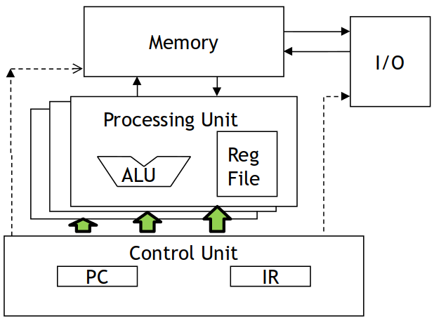]

.footnote[Джерело слайду: NVIDIA, DLI]

---

class: blue-slide, middle, center
count: false

.larger-xx[Обмеження потужності ресурсів виконання]

---

class: middle

# Варпи як одиниці виконання

Кожен блок виконується у варпі на 32 потоки

  - Реалізація не є частиною програмної моделі CUDA
  - Варпи є одиницями виконання в багатопоточних мультипроцесорах
  - Потоки у варпі виконуються за моделлю SIMD
  - Майбутні версії GPU можуть мати іншу кількість потоків у варпі

.footnote[Джерело слайду: NVIDIA, DLI]

???
У GPU NVIDIA основною одиницею виконання є варп. Варп - це набір потоків, 32 потоки у поточних реалізаціях, які виконуються одночасно SM. Кілька варпів можуть бути виконані на SM одночасно.

---

class: middle

# Приклад роботи варпа

Якщо 3 блоки по 256 потоки кожен призначено на мультипроцесор, скільки варпів буде відправлено на SM?
- Кількість варпів в одному блоці: $256/32 = 8$
- Загальна кількість варпів: $3*8=24$ 

.center.width-70[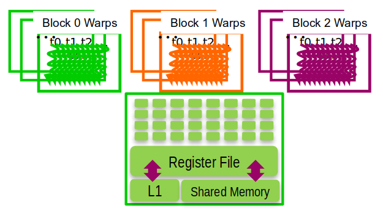]

.footnote[Джерело слайду: NVIDIA, DLI]

---

class: blue-slide, middle, center
count: false

.larger-xx[Планування потоків без накладних витрат]

---

class: middle

# Планування потоків

SM виконує планування потоків без накладних витрат

- Варпи, операнди наступних інструкцій яких вже обчислені, стають претендентами на виконання
- Варпи, що претендують на виконання, відбираються на виконання, дотримуючись обраної політики пріоритетів
- Усі потоки у варпі виконують одні й тій ж самі інструкції

.footnote[Джерело слайду: NVIDIA, DLI]

---

class: middle
# Література

PMPP Ch. 3, pp. 43-69

[.center.width-50[]](https://www.amazon.com/Programming-Massively-Parallel-Processors-Hands/dp/0128119861/ref=sr_1_fkmr0_2?crid=2YR2Y8FMYMZRB&keywords=Programming+Massively+Parallel+Processors%3A+A+Hands-on+Approach+3rd+Edition&qid=1643962972&s=books&sprefix=programming+massively+parallel+processors+a+hands-on+approach+3rd+edition+%2Cstripbooks-intl-ship%2C171&sr=1-2-fkmr0)

---

class: end-slide, center
count: false

.larger-xx[Кінець 🏁]

