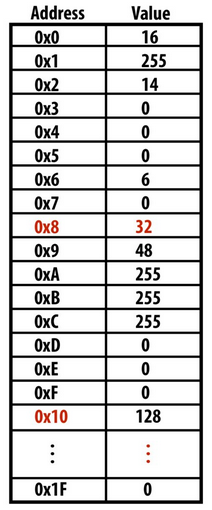
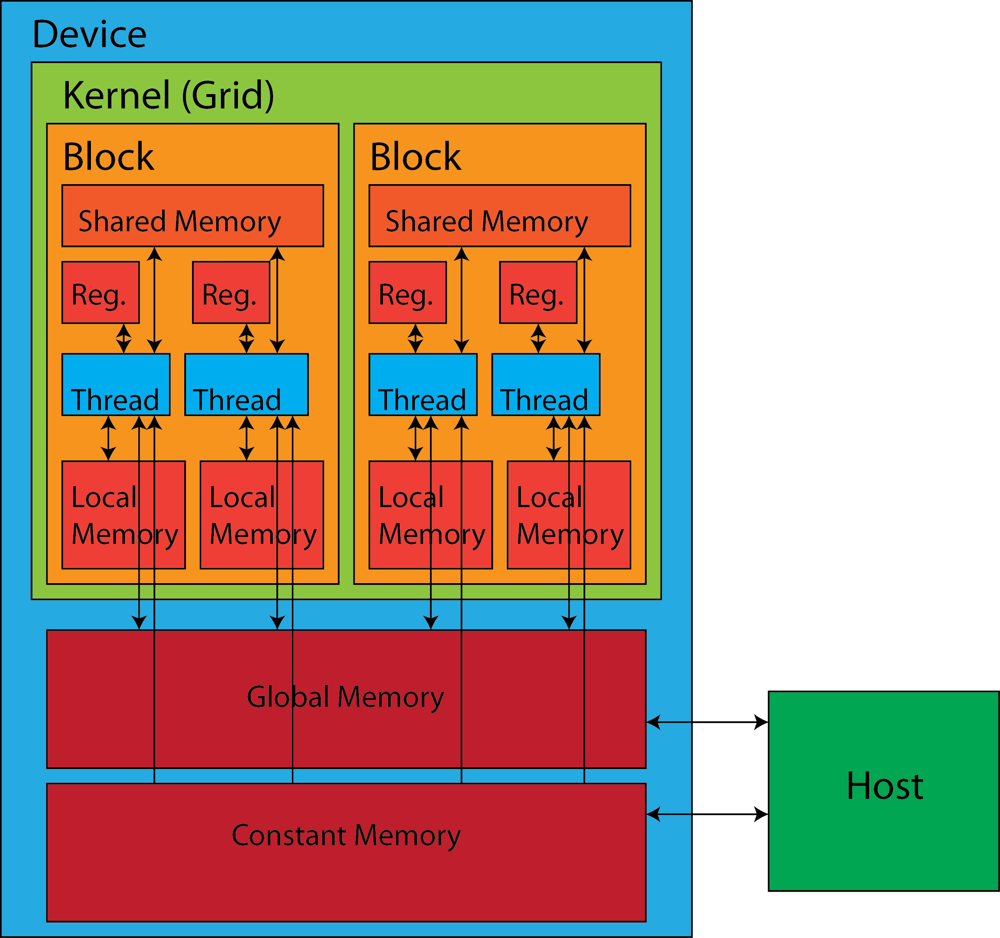
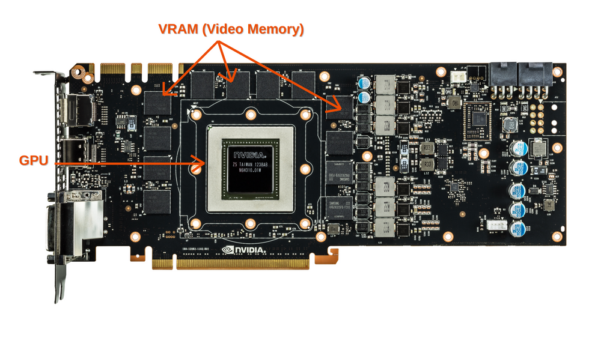

class: middle, center, title-slide 
<br>
# Технології графічного процесінгу & розподілених обчислень

Лекція 5: Пам'ять та місце зберігання даних

<br><br>
Кочура Юрій Петрович<br>
[iuriy.kochura@gmail.com](mailto:iuriy.kochura@gmail.com) <br>
<a href="https://t.me/y_kochura">@y_kochura</a> <br>

???
Пам'ять і зберігання даних є важливими поняттями в програмуванні GPU CUDA. Щоб досягти високої продуктивності під час використання GPU, важливо звести до мінімуму передачу даних між хостом (CPU) і пристроєм (GPU), а також переконатися, що дані, до яких отримує доступ потік, зберігаються в найближчих місцях пам’яті.

Пам'ять у GPU CUDA поділяється на різні типи, включаючи глобальну пам'ять, спільну пам'ять і регістри. Глобальна пам'ять — це найбільший простір пам'яті, який використовується для зберігання даних, до яких мають доступ усі потоки в ядрі. Спільна пам’ять — це менший простір пам’яті, який спільно використовується між потоками в межах блоку потоків і може використовуватися для покращення локальності даних. Регістри — це невеликі швидкі простори пам’яті, які виділяються кожному потоку для зберігання часто використовуваних змінних.

Локальність даних відноситься до тенденції потоків отримувати доступ до сусідніх ділянок пам'яті. Переконавшись, що дані, до яких отримує доступ потік, зберігаються в найближчих місцях пам’яті, можна зменшити кількість звернень до пам’яті та таким чином підвищити продуктивність. Цього можна досягти, використовуючи спільну пам'ять для кешування даних, до яких часто звертаються потоки в блоці. Використовуючи спільну пам'ять, потоки можуть отримувати доступ до даних без необхідності довготривалого доступу до глобальної пам'яті.

---


class: middle

# Сьогодні

Мета &mdash; навчитися ефективно використовувати різні типи пам'яті CUDA у паралельному програмуванні

- Важливість ефективного доступу до пам'яті
- Регістри, cпільна (shared) пам'ять, глобальна (global) пам'ять
- Область видимості та час життя 

???
Загалом пам’ять і локальність даних є важливими концепціями, які слід розуміти під час програмування графічних процесорів з використанням CUDA. Мінімізуючи передачу даних між хостом і пристроєм і оптимізуючи локальність (зберігання) даних, можна досягти більш високопродуктивних паралельних обчислень на GPU.

---


class: middle,

# Що таке пам'ять?

.center.width-80[]

???
Пам'ять комп'ютера - це пристрій або система електронних компонентів, які забезпечують збереження та доступ до даних та інструкцій, які обробляються процесором комп'ютера. Ця пам'ять може бути фізичною (такою як оперативна пам'ять або жорсткий диск) або віртуальною (такою як віртуальна пам'ять).


В основі роботи запам'ятовувальних пристроїв може лежати будь-який фізичний ефект, що забезпечує приведення системи до двох або кількох стійких станів. У сучасних комп'ютерах часто використовуються фізичні властивості напівпровідників, коли проходження струму через напівпровідник або його відсутність трактується як наявність логічних сигналів 0 або 1. Стійкі стани, що визначаються напрямком намагніченості, дозволяють використовувати для зберігання даних різноманітні магнітні матеріали. Наявність або відсутність заряду в конденсаторі також може бути покладена в основу системи зберігання інформації.

Оперативна пам'ять (RAM) - це тип пам'яті, що забезпечує швидкий доступ до даних та інструкцій, які використовуються процесором у поточний момент. Вона зберігається на чипах, які можуть бути розміщені на материнській платі комп'ютера або в модулях пам'яті.


Жорсткий диск - це тип пам'яті, що зберігає дані на магнітних дисках, які зазвичай знаходяться внутрішньо в комп'ютері. Вони забезпечують довготривале зберігання даних, які зберігаються навіть після вимкнення комп'ютера.

Віртуальна пам'ять - це механізм, що дозволяє комп'ютеру використовувати частину жорсткого диска як додаткову пам'ять, яка може використовуватися, коли оперативна пам'ять заповнюється. Це забезпечує більшу кількість доступної пам'яті для виконання програм та забезпечує підтримку більших обсягів даних.

---


class: middle,

# Адресний простір програми

.grid[
.smaller-x.kol-3-4[
- Пам'ять комп'ютера організована як масив байтів
- Кожен байт ідентифікується за адресою в пам'яті 

**За адресою 0х8 зберігається значення 32**

**За адресою 0х10 зберігається значення 128**

]
.smaller-x.kol-1-4[
.center.width-90[]
]
]

.footnote[Джерело слайду:  Stanford CS149, Fall 2022 PARALLEL COMPUTING [A Modern Multi-Core Processor](https://gfxcourses.stanford.edu/cs149/fall22/lecture/multicorearch/slide_50)]

---


class: middle,

# Доступ до пам'яті

.center.width-50[]

.footnote[Джерело слайду: [Introduction to GPGPU and CUDA Programming: Memory Architecture ](https://cvw.cac.cornell.edu/gpu/memory_arch)]

???
[Пристрій CUDA (GPU)](https://cvw.cac.cornell.edu/gpu/memory_arch) має низку різних компонентів пам’яті, які доступні програмістам – регістр, спільна пам’ять, локальна пам’ять, глобальна пам’ять і постійна пам’ять. На зображенні показано, як потоки в пристрої CUDA можуть отримати доступ до різних компонентів пам’яті. У CUDA лише потоки та хост можуть отримати доступ до пам’яті.

Тут використано одно- та двосторонні стрілки, щоб позначити можливість читання (R) і запису (W). Стрілка, що вказує на компонент пам’яті позначає можливість запису; стрілка, що вказує від компонента пам'яті, позначає можливість читання. Наприклад, глобальну пам’ять і постійну пам’ять можна читати (R) або записувати (W).

На пристрої CUDA можна викликати кілька ядер. Кожне ядро є незалежною сіткою, що складається з одного або кількох блоків. Кожен блок має власну спільну пам'ять для кожного блоку, яка використовується спільно між потоками в цьому блоці. Усі потоки можуть отримувати доступ (R/W) до різних частин пам’яті пристрою.

Загалом ми використовуємо хост для:
- Передачі даних у/з глобальної пам'яті
- Передачі даних у/з постійної пам'яті


Коли дані знаходяться в пам’яті пристрою, наші потоки можуть читати та записувати (R/W) різні частини пам’яті:
- Регістр R/W для кожного потоку
- Локальну пам'яті R/W для кожного потоку
- Спільну пам'ять R/W для кожного блоку
- Глобальна пам'ять R/W для кожної сітки
- Постійну пам'ять R для кожної сітки 

---


class: middle

# Рівні пам'яті

.center.width-70[]
.center.smaller-x.width-70[Iєрархія пам’яті в Tesla V100]

.footnote[Джерело слайду: [Understanding GPU Architecture: Memory Levels](https://cvw.cac.cornell.edu/GPUarch/memory_levels)]

???

Так само, як центральний процесор, графічний процесор покладається на ієрархію пам’яті, щоб гарантувати, що його механізми обробки забезпечуються даними, необхідними для виконання корисної роботи. І так само, як ядра в ЦП, потокові мультипроцесори (SM) у GPU вимагають, щоб дані були в регістрах для того, щоб бути доступними для обчислень.

Порівняно з ядром процесора, SM має набагато більше регістрів. Наприклад, SM у NVIDIA Tesla V100 має 65536 регістрів у своєму файлі реєстрів. Якщо взяти в цілому, його регістровий файл також більший з точки зору загальної ємності, незважаючи на те, що 4-байтові регістри SM містять лише одне число з плаваючою точкою, тоді як векторні регістри в ядрі Intel AVX-512 містять 16 чисел з плаваючою точкою.

Але процесори мають перевагу в загальному розмірі кешу. Кожне ядро процесора Intel оснащено кешами даних L1 і L2, і розмір цих кеш-пам’ятей плюс його частка спільного кешу L3 легко перевищує розмір еквівалентних кеш-пам’ятей у GPU. На рисунку показана повна картина ієрархії пам’яті в Tesla V100. Ролі різних типів кешу та пам’яті буде розглянуто далі.


Стрілки на наведеній діаграмі показують, як шари пам’яті пов’язані разом. Залежно від того, звідки починаються дані, їм, можливо, доведеться перескочити через кілька рівнів кешу, щоб увійти в регістри SM і стати доступними для ядер CUDA. Глобальна пам’ять (включно з областями для локальної, текстурної та постійної пам’яті) є найбільшим шаром, але він також найдальший від SM. 

Очевидно, було б сприятливо, щоб 4-байтові операнди подорожували разом у групах по 32, коли вони рухаються туди-сюди між кешами, регістрами та ядрами CUDA. Чому? 32 точно підходить для забезпечення варпу з 32 потоків одночасно. Тому цілком зрозуміло, що розмір рядка кешу в графічному процесорі становить 32 х (4 байти) = 128 байтів.


Зауважте, що передача даних на пристрій і з нього здійснюється через кеш L2. У більшості випадків вхідні дані надходять із L2 у велику глобальну пам’ять пристрою.

Iєрархія пам’яті GPU є більш складною, ніж для центрального процесора, оскільки графічний процесор резервує певні області пам’яті для спеціального використання під час візуалізації.  

---

class: middle

# Вбудована пам'ять

- Register File
- L1 Cache
- Shared Memory
- Constant Caches

.footnote[Джерело слайду: [Understanding GPU Architecture: Memory Levels](https://cvw.cac.cornell.edu/GPUarch/memory_levels)]

???

Вбудована пам'ять (on-chip memory)

*Register File (файл реєстру)* &mdash; позначає область пам'яті, яка надходить безпосередньо до ядер CUDA. Відповідно, він організований у групу з 32 банки, що відповідають 32 потокам варпу. Ми можемо представити файл реєстру як велику матрицю з 4-байтових елементів, яка має багато рядків і 32 стовпці. Варп працює на повних рядках; у певному рядку кожен потік (ядро CUDA) працює з іншим стовпцем (банком).

*Кеш-пам'ять L1*  &mdash; це звичайне місце зберігання на мікросхемі, що забезпечує швидкий доступ до даних, нещодавно зчитаних або записаних у основну пам'ять (RAM). Крім того, L1 служить областю переповнення, коли кількість активних даних перевищує те, що може вмістити файл реєстру SM, умова, яка називається "розливом реєстру". У L1 рядки кешу та розлиті регістри організовані в банки, як і у файлі регістрів.

*Shared Memory (cпільна пам'ять)* &mdash; це область пам'яті, яка фізично знаходиться в тій самій пам'яті, що й кеш L1, але відрізняється від L1 тим, що всі її дані можуть бути доступні будь-якому потоку в блоці потоку. Це дозволяє потокам спілкуватися та обмінюватися даними один з одним. Змінні, які його займають, повинні бути явно оголошені програмою. Програма також може встановити межу між L1 і спільною пам'яттю.

*Кеші констант (Constant Caches)* &mdash; це спеціальні кеші, що стосуються змінних, оголошених як константи лише для читання в глобальній пам'яті. Такі змінні можуть бути прочитані будь-яким потоком у блоці потоку. Основним і найкращим використанням цих кешів є трансляція одного постійного значення для всіх потоків у варп.

---


class: middle

# Віддалена пам'ять

- L2 Cache
- Global Memory
- Local Memory
- Texture and Constant Memory

.footnote[Джерело слайду: [Understanding GPU Architecture: Memory Levels](https://cvw.cac.cornell.edu/GPUarch/memory_levels)]

???

Цей список стосується більш віддалених, більших областей пам’яті, які є спільними для всіх SM.

*Кеш-пам'ять L2 (L2 Cache)*  &mdash;  це додатковий вбудований кеш-пам'ять для збереження копій даних, які переміщуються між SM та основною пам'яттю. Як і L1, кеш L2 призначений для прискорення наступних перезавантажень. Але на відміну від кеш-пам’яті L1, існує лише один L2, який використовується спільно для всіх SM. Кеш L2 також розташований на шляху переміщення даних на пристрій або з нього через PCIe або NVLink.

*Глобальна пам’ять* — це основна частина основної пам’яті пристрою, еквівалентна ОЗУ (RAM) в CPU. З міркувань продуктивності Tesla V100 має спеціальну пам’ять HBM2 з високою пропускною здатністю, тоді як Quadro RTX 5000 має швидку графічну пам’ять GDDR6.

*Локальна пам'ять* - відповідає спеціально відображеним областям основної пам'яті, які призначені кожному SM. Кожного разу, коли «розлив реєстру» переповнює кеш L1 на певному SM, зайві дані далі вивантажуються до L2, а потім у «локальну пам’ять». 

Текстура та постійна пам’ять – це області основної пам’яті, які пристрій розглядає як доступні лише для читання. При отриманні в SM змінні з оголошенням "текстури" або "константи" можуть бути прочитані будь-яким потоком у блоці потоку, подібно до спільної пам'яті. Текстурна пам'ять кешується в L1, тоді як постійна пам'ять кешується в кеші констант.


---


class: middle

# Розмір і пропускна здатність

.center.width-90[]

.footnote[Джерело слайду: [GPU Memory bandwidth](https://blog.paperspace.com/gpu-memory-bandwidth/)]

???
Розмір пам'яті та пропускна здатність є важливими характеристиками графічного процесора CUDA, які можуть мати значний вплив на його продуктивність.

Розмір пам’яті означає обсяг пам’яті, доступної на GPU для зберігання даних та інструкцій. Обсяг пам’яті графічного процесора, як правило, набагато більший, ніж розмір пам’яті центрального процесора, і може коливатися від кількох гігабайт до десятків гігабайт, залежно від конкретної моделі графічного процесора. Обсяг пам’яті, необхідний для певної програми, залежить від розміру набору даних, що обробляється, і конкретних алгоритмів, які використовуються. Якщо набір даних перевищує обсяг доступної пам’яті, програмі може знадобитися використовувати такі методи, як сторінка пам’яті (memory paging) або фрагментація (chunking), щоб обробити дані меншими фрагментами.

Пропускна здатність пам’яті означає швидкість, з якою дані можуть передаватися між пам’яттю GPU та блоками обробки GPU. Вища пропускна здатність пам’яті забезпечує швидшу передачу даних, що може підвищити продуктивність програм, які потребують пам’яті. Пропускна здатність пам’яті GPU зазвичай вимірюється в гігабайтах на секунду (ГБ/с) і залежить від таких факторів, як технологія пам’яті, яка використовується, тактова частота пам’яті та ширина шини пам’яті.

Архітектура пам'яті GPU також може впливати на його продуктивність. Наприклад, деякі графічні процесори можуть мати уніфіковану архітектуру пам’яті, де одна й та сама пам’ять спільно використовується між графічним і центральним процесорами, а інші можуть мати окрему пам’ять для центрального і графічного процесорів. Уніфікована архітектура пам’яті може спростити керування пам’яттю, але це може призвести до зниження продуктивності через додаткові накладні витрати на керування спільною пам’яттю.

Різні компоненти пам'яті мають різний розмір і пропускну здатність. Глобальна пам’ять має найнижчу пропускну здатність, але найбільший розмір пам’яті. Поблочна спільна пам'ять швидша, ніж глобальна пам'ять і постійна пам'ять, але повільніша, ніж регістри потоку. Потокові регістри можуть зберігати лише невелику кількість даних, але є найшвидшими. Потокова локальна пам'ять працює повільніше, ніж регістри, і використовується для зберігання даних, які не можуть поміститися в регістр.

Загалом, розмір пам’яті та пропускна здатність графічного процесора CUDA є важливими факторами, які слід враховувати при виборі графічного процесора для конкретної програми, оскільки вони можуть мати значний вплив на продуктивність програми.

---

class: middle

# Кваліфікатори

| Qualifiers                                | Location  | Scope   | Lifespan    |
|-------------------------------------------|-----------|---------|-------------|
| Automatic variable                        | Register  | Thread  | Kernel      |
| Automatic array                           | Local     | Thread  | Kernel      |
| `__device__` ,` __shared__` , int SharedVar   | Shared    | Block   | Kernel      |
| `__device__` , int GlobalVar                | Global    | Grid    | Application |
| `__device__` , `__constant__` , int ConstVar  | Constant  | Grid    | Application |


.footnote[Джерело слайду:  [Introduction to GPGPU and CUDA Programming: Memory Architecture](https://cvw.cac.cornell.edu/gpu/memory_arch)]

???

CUDA підтримує різні типи кваліфікаторів для призначення змінних різним компонентам пам’яті. Різні компоненти пам'яті також мають термін служби. У наведеній таблиці подано узагальнено обсяг, тривалість життя та тип пам’яті для різних кваліфікаторів.

---


class: middle

# Automatic Variables
.center.larger-xx[
```c++
int autovar;

```
]

???
Автоматична змінна оголошується без будь-яких кваліфікаторів. Вона знаходиться в регістрі кожного потоку і доступна лише для цього потоку.

---

class: middle

# Automatic Arrays
.center.larger-xx[
```c++
int autoarr[];

```
]

???
Змінна автоматичного масиву зберігається в локальній пам’яті кожного потоку і доступна лише цьому потоку. Однак компілятор може зберігати автоматичні масиви в регістрах, якщо весь доступ здійснюється з постійними значеннями індексів. Автоматичний масив можна оголосити таким чином.

---


class: middle

# `__shared__`

.larger-x[
```c++
__shared__ int shvar;

//is the same as

__device__ __shared__ int shvar2;


```
]

???
Додавання кваліфікатора типу змінної __shared__ явно оголошує, що змінна є спільною в межах блоку потоку. Ви можете додати додатковий кваліфікатор типу змінної __device__, щоб досягти того самого ефекту.

---

class: middle

# `__device__`

.center.larger-xx[
```c++
__device__ int dvvar;

```
]

???
Коли кваліфікатор __device__ використовується сам по собі, він оголошує, що змінна знаходиться в глобальній пам’яті.

---


class: middle

# `__constant__`

.larger-x[
```c++
__constant__ int cnvar;

//is the same as

__device__ __constant__ int cnvar2;


```
]

???
Додавання кваліфікатора __constant__ оголошує постійну змінну, яка знаходиться в пам’яті констант. Ви також можете додати додатковий __device__, щоб досягти того самого ефекту. Константна змінна має бути оголошена поза тілом будь-якої функції.

---


class: middle

# Оголошення за адресою

.larger-xx[
```c++
float *ptr= &GlobalVar;

```
]

???
Ви також можете призначити адресу змінної, оголошеної в спільній, постійній або глобальній пам'яті, змінній-вказівнику.

---


class: middle
# Література

PMPP Ch. 4, pp. 71-101

[.center.width-50[]](https://www.amazon.com/Programming-Massively-Parallel-Processors-Hands/dp/0128119861/ref=sr_1_fkmr0_2?crid=2YR2Y8FMYMZRB&keywords=Programming+Massively+Parallel+Processors%3A+A+Hands-on+Approach+3rd+Edition&qid=1643962972&s=books&sprefix=programming+massively+parallel+processors+a+hands-on+approach+3rd+edition+%2Cstripbooks-intl-ship%2C171&sr=1-2-fkmr0)


---

class: end-slide, center
count: false

.larger-xx[Кінець 🏁]

