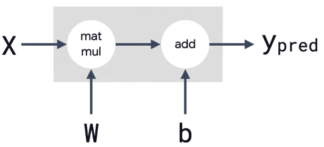
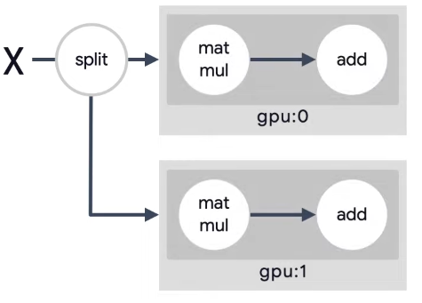
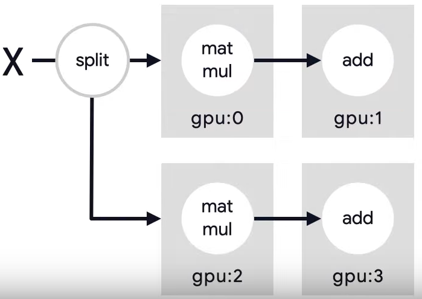

class: middle, center, title-slide 
<br>
# Технології графічного процесінгу & розподілених обчислень

Лекція 7: Розподілене навчання

<br><br>
Кочура Юрій Петрович<br>
[iuriy.kochura@gmail.com](mailto:iuriy.kochura@gmail.com) <br>
<a href="https://t.me/y_kochura">@y_kochura</a> <br>

???
Сьогодні ми продовжимо обговорювати тему «Використання кількох графічних процесорів у машинному навчанні». Зі збільшенням складності та розміру моделей навчання цих моделей на одному GPU стає все складнішим. В останні роки використання систем з кількома GPU стало досить популярним для прискорення процесу навчання та обробки досить великих наборів даних.

Одним із ключових факторів, що впливають на ефективність машинного навчання, є обчислювальна потужність. Завдяки мультиграфічним процесорам (GPU), які спеціалізуються на обробці графічних даних, машинне навчання стало значно швидшим та ефективнішим.

Один з головних факторів, який дозволяє GPU прискорити машинне навчання - це паралельна обробка даних. В основі багатьох алгоритмів машинного навчання лежать матричні операції, які можна виконувати паралельно на багатьох ядрах GPU. Крім того, GPU має значно більшу кількість ядер порівняно з CPU, що дозволяє виконувати більше операцій одночасно та зменшити час навчання моделі. GPU використовує технологію SIMD (Single Instruction Multiple Data), що дозволяє виконувати одну і ту саму операцію на декількох незалежних наборах даних одночасно. Завдяки цьому GPU швидко може обробляти великі об'єми даних, що є дуже важливим у машинному навчанні.

Розподілене навчання — це техніка машинного навчання, яка передбачає навчання моделі з використанням кількох процесорів, наприклад кількох комп’ютерів або графічних процесорів, замість одного процесора. Розподіляючи обчислювальне навантаження, розподілене навчання може значно скоротити час, необхідний для навчання великомасштабної моделі.

У традиційному машинному навчанні одна машина обробляє дані, навчає модель і робить прогнози. Однак із збільшенням обсягу даних і складності моделей цей процес стає інтенсивним з точки зору обчислень і може тривати дні або навіть тижні. Розподілене навчання вирішує цю проблему, розбиваючи дані на менші частини та розподіляючи їх між кількома процесорами.


---


class: middle

# Сьогодні

- Чому розподілене навчання?
- Паралелізм даних vs. паралелізм моделі


???
Джерело: [A friendly introduction to distributed training (ML Tech Talks)](https://www.youtube.com/watch?v=S1tN9a4Proc&t=3s)
На початку поговориму чому розподілене навчання корисне. Далі поговоримо про два типи паралелізму: паралелізм даних vs. паралелізм моделі - два різних способи реалізації розподіленого навчання. На останок розглянемо два різних алгоритми паралелізму даних.

---


class: middle,

# Чому розподілене навчання?

Використання спеціального апаратного забезпечення дозполяє значно .bold[*скоротити*] час навчання


???
Перш ніж занурюватись в деталі, давайте розглянемо чому розподілене навчання важливе. 

---

class: middle,
count: false

# Чому розподілене навчання?

.inactive[Використання спеціального апаратного забезпечення дозполяє значно .bold[*скоротити*] час навчання]

Коротший час навчання забезпечує .bold[*швидшу ітерацію*] для досягнення ваших цілей моделювання

???
Якщо навчання триває кілька хвилин або годин ми можемо шивдко перевірити різні гіпотези та знайти оптимальну конфігурацію гіперпараметрів для поставленої задачі. Проте якщо навчання триває кілька тижнів, досить складно швидко здійснювати перевірку нових гіпотез та ідей. Використання спеціального апаратного забезпечення дозполяє значно .bold[*скоротити*] час навчання, а тому і пришивдшити ітерацію перевірки нових гіпотез та тестування нових ідей. 

Іншими словами однією з ключових переваг розподіленого навчання є його здатність до ефективного масштабування. Зі збільшенням розміру набору даних або моделі до процесу навчання можна додавати більше одиниць обробки, що забезпечує швидше та ефективніше навчання. Крім того, розподілене навчання також може підвищити точність моделі, оскільки для навчання можна використовувати більше даних.

---


class: middle,

# Розподілення не автоматичне

```bash
Sun Apr 23 11:32:07 2023       
+-----------------------------------------------------------------------------+
| NVIDIA-SMI 470.161.03   Driver Version: 470.161.03   CUDA Version: 11.4     |
|-------------------------------+----------------------+----------------------+
| GPU  Name        Persistence-M| Bus-Id        Disp.A | Volatile Uncorr. ECC |
| Fan  Temp  Perf  Pwr:Usage/Cap|         Memory-Usage | GPU-Util  Compute M. |
|                               |                      |               MIG M. |
|===============================+======================+======================|
|   0  Tesla T4            Off  | 00000000:00:04.0 Off |                    0 |
| N/A   56C    P8    10W /  70W |  12105MiB / 15109MiB |      75%      Default|
|                               |                      |                  N/A |
+-------------------------------+----------------------+----------------------+
|   1  Tesla T4            Off  | 00000000:00:05.0 Off |                    0 |
| N/A   59C    P8    10W /  70W |      0MiB / 15109MiB |      0%      Default |
|                               |                      |                  N/A |
+-------------------------------+----------------------+----------------------+
```
???
Для того, щоб використовувати кілька GPU (>1) потрібно виконати додаткову роботу. Це потрібно для того, щоб TensorFlow зміг координувати навчання між кількома GPU. Реалізація розподіленого навчання вимагає ретельного розгляду кількох факторів, таких як накладні витрати на зв’язок між процесорами, балансування навантаження та відмовостійкість. Правильне управління цими факторами може гарантувати, що розподілене навчання буде продуктивним та ефективним.

---


class: middle, 

# Способи розподіленого навчання

.center.grid[
.bold.larger-x.kol-1-2[
Паралелізм даних

.smaller-xx[
- Синхронний паралелізм даних
- Асинхронний паралелізм даних
]

]
.bold.larger-x.kol-1-2[
Паралелізм моделі

]
]

???
Розподілене навчання можна реалізувати різними способами, наприклад за допомогою паралелізму даних або паралелізму моделі. У паралелізмі даних дані розбиваються на менші частини (пакети), і кожен процесор тренується на підмножині даних. У паралелізмі моделі модель ділиться на менші частини, і кожен блок обробки навчається на іншій частині моделі.

---

class: middle, 
count: false

# Способи розподіленого навчання

.center.grid[
.bold.larger-x.kol-1-2[
Паралелізм даних

.smaller-xx[
- Синхронний паралелізм даних
- Асинхронний паралелізм даних
]

]
.inactive.bold.larger-x.kol-1-2[
Паралелізм моделі

]
]

???
У паралелізмі даних дані розподіляються між різними вузлами, і кожен вузол навчає модель на підмножині даних. Потім градієнти об’єднуються між вузлами для оновлення параметрів моделі.

Синхронне та асинхронне навчання: це два поширені способи розподілу навчання з паралелізмом даних. Під час синхронного навчання всі GPU тренуються на різних фрагментах вхідних даних синхронно та агрегують градієнти на кожному кроці. У асинхронному навчанні всі GPU незалежно навчаються на вхідних даних та асинхронно оновлюють змінні. Зазвичай синхронне навчання за допомогою алгоритма all-reduce, а асинхронне -- архітектури сервера параметрів.

---


class: middle,   

.larger-x[
```python
model.fit(x, y, batch_size=32)
```
]
---

class: middle,

.larger-x[
```python
model.fit(x, y, batch_size=32)
```

```python
model.fit(x, y, batch_size=(32 * NUM_GPUS))
```
 ]
---

class: middle

# Лінійна модель

.larger-x.center[$y_{\text{pred}} = WX + b$]

.center.width-50[]

```python
tf.keras.layers.Dense(units=1)
```

---


class: middle
count: false

# Паралелізм даних

.center.grid[
.bold.kol-1-2[
.larger-x[$y_{\text{pred}} = WX + b$]

.center.width-90[]

```python
tf.keras.layers.Dense(units=1)
```

]
.inactive.bold.larger-x.kol-1-2[
.center.width-90[]

]
]

---

class: middle, 
count: false

# Способи розподіленого навчання

.center.grid[
.inactive.bold.larger-x.kol-1-2[
Паралелізм даних

]
.bold.larger-x.kol-1-2[
Паралелізм моделі

]
]

???
У паралелізмі моделі модель розбивається на частини між різними вузлами, кожен вузол навчає частину моделі. Результати кожної частини об’єднуються для отримання остаточного результату.

---

class: middle
count: false

# Паралелізм моделі

.center.grid[
.bold.kol-1-2[
.larger-x[$y_{\text{pred}} = WX + b$]

.center.width-90[]

```python
tf.keras.layers.Dense(units=1)
```

]
.middle.bold.larger-x.kol-1-2[
.center.width-90[]

]
]

---

class: middle

# Комбінація
.center.grid[
.bold.kol-1-2[
.larger-x[$y_{\text{pred}} = WX + b$]

.center.width-90[]

```python
tf.keras.layers.Dense(units=1)
```

]
.middle.bold.larger-x.kol-1-2[
.center.width-90[]

]
]

---

class: middle

# Стратегії навчання

- .bold[*Агрегація градієнтів*]: об’єднання градієнтів із кількох графічних процесорів може бути дорогим у плані обчислень. Щоб зменшити цю вартість, можна рідше об’єднувати градієнти або використовувати методи стиснення, щоб зменшити розмір градієнтів.
- .bold[*Перекриття зв’язку та обчислення*]: поки один GPU обчислює градієнти, інші GPU можуть отримувати дані та готуватися до наступної партії. Це може допомогти скоротити загальний час навчання.
- .bold[*Балансування робочого навантаження*]: залежно від розміру моделі та обсягу даних деякі графічні процесори можуть виконувати роботу швидше, ніж інші. Щоб максимізувати продуктивність, вам слід збалансувати робоче навантаження на всі графічні процесори.


???
Під час впровадження навчання з кількома графічними процесорами є кілька стратегій, які можна використовувати для оптимізації продуктивності, зокрема:

---


class: middle
# Література

1. [A friendly introduction to distributed training ](https://www.youtube.com/watch?v=S1tN9a4Proc&t=3s)
1. [Deep learning on the parameter server](https://proceedings.neurips.cc/paper_files/paper/2012/file/6aca97005c68f1206823815f66102863-Paper.pdf)
1. [Scaling Distributed Machine Learning with the Parameter Server](https://www.cs.cmu.edu/~muli/file/parameter_server_osdi14.pdf)
1. [Overview of how TensorFlow does distributed training](https://www.tensorflow.org/guide/distributed_training)
1. [Deep learning on the parameter server](https://proceedings.neurips.cc/paper_files/paper/2012/file/6aca97005c68f1206823815f66102863-Paper.pdf)


???
https://www.cs.cornell.edu/courses/cs4787/2022fa/


Використання кількох графічних процесорів може значно скоротити час навчання глибоких нейронних мереж. Використовуючи паралелізм даних, паралелізм моделей або гібридний паралелізм, ми можемо розподілити обчислення між кількома графічним процесором і досягти кращої продуктивності. Під час впровадження навчання з кількома GPU важливо вибрати правильну бібліотеку програмного забезпечення, конфігурацію обладнання та стратегії оптимізації для досягнення найкращих результатів.

Однак існують також деякі проблеми з використанням систем із кількома GPU у машинному навчанні. По-перше, вартість може бути великою. Системи з кількома GPU можуть бути дорогими, особливо якщо взяти до уваги вартість графічних процесорів високого класу. По-друге, необхідно правильно розподілити навантаження. В асиметричних системах вкрай важливо забезпечити правильний розподіл робочого навантаження, щоб уникнути проблем. Нарешті, зв’язок між графічними процесорами може бути слабким місцем. Зв’язок між графічними процесорами може бути повільнішим, ніж обчислення, що може призвести до зниження продуктивності.

---

class: end-slide, center
count: false

.larger-xx[Кінець 🏁]

